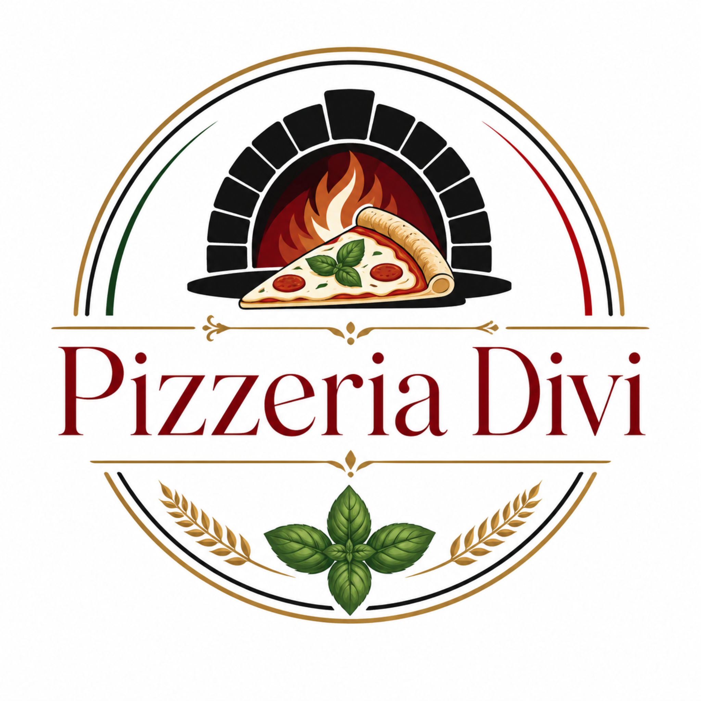

# Codes des fichiers — Pizzeria Divi

Ce document contient le code source texte du site multi-pages.

## `index.html`

```html
<!doctype html>
<html lang="fr">
<head>
  <meta charset="utf-8">
  <meta name="viewport" content="width=device-width, initial-scale=1">
  <title>Accueil — DIVI La Roche</title>
  <meta name="description" content="Site vitrine de la pizzeria DIVI à la Roche, Court-St.-Étienne.">
  <link rel="stylesheet" href="assets/styles.css">
  <link rel="icon" href="assets/favicon.ico" sizes="any">
  <link rel="icon" type="image/png" href="assets/favicon-32.png" sizes="32x32">
  <link rel="apple-touch-icon" href="assets/apple-touch-icon.png">
  <script src="assets/script.js" defer></script>
</head>
<body class="">
  
    <header class="site-header">
      <a class="brand brand-logo" href="index.html" aria-label="Accueil Pizzeria Divi">
        
        <span><strong>Pizzeria Divi</strong><small>La Roche • Belgique</small></span>
      </a>
      <button class="menu-toggle" aria-label="Ouvrir le menu" aria-expanded="false">☰</button>
      <nav class="main-nav" aria-label="Navigation principale">
        <a class="nav-link active" href="index.html">Accueil</a>
<a class="nav-link " href="a-propos.html">À propos</a>
<a class="nav-link " href="menu.html">Menu complet</a>
<a class="nav-link " href="pizzas.html">Pizzas</a>
<a class="nav-link " href="boissons.html">Boissons</a>
<a class="nav-link " href="reservation.html">Réserver</a>
<a class="nav-link " href="contact.html">Contact</a>
      </nav>
      <a class="header-call" href="tel:010657560">Réserver • 010 65 75 60</a>
    </header>
    
  <main>
    
<section class="hero">
  <div class="hero-bg">
    
    
  </div>
  <div class="hero-content">
    
    <p class="eyebrow">Rue de la Roche • Court-St.-Étienne</p>
    <h1>Pizzeria Divi, l’esprit italien autour d’une pizza généreuse.</h1>
    <p class="hero-lead">Un site vitrine élégant pour présenter la pizzeria DIVI en Belgique : pizzas, pâtes, cocktails, vins, horaires et réservation par téléphone.</p>
    <div class="hero-actions">
      <a class="btn primary" href="menu.html">Voir le menu complet</a>
      <a class="btn ghost" href="reservation.html">Réserver une table</a>
    </div>
    <div class="hero-meta">
      <span>☎ 010 65 75 60</span>
      <span>📍 Rue de la Roche 53, 1490 Court-St.-Étienne</span>
    </div>
  </div>
</section>

<section class="intro-grid container">
  <div class="panel intro-copy">
    <p class="eyebrow">Bienvenue</p>
    <h2>Brasserie / restaurant italien à l’ambiance moderne</h2>
    <p>DIVI vous accueille dans un décor raffiné et contemporain, avec l’énergie d’une cuisine italienne ouverte sur la salle et une terrasse agréable quand le soleil est au rendez-vous.</p>
    <a class="text-link" href="a-propos.html">Découvrir l’ambiance →</a>
  </div>
  <div class="image-stack">
    
    <div class="floating-card">
      <strong>Ouvert du mardi au dimanche</strong>
      <span>Service midi et soir selon les jours</span>
    </div>
  </div>
</section>

<section class="container">
  <div class="section-heading center">
    <p class="eyebrow">À la carte</p>
    <h2>Pizzas signatures</h2>
    <p>Quelques recettes fortes de la carte, à mettre en avant dès l’accueil.</p>
  </div>
  <div class="menu-grid featured-grid">
    <article class="menu-card searchable" data-search="divi tomate, fior di latte, gorgonzola, salami, jambon, champignons signature">
      
      <div class="menu-card-body">
        <div class="menu-card-top">
          <h3>Divi</h3>
          <span class="price">20€</span>
        </div>
        <p>Tomate, fior di latte, gorgonzola, salami, jambon, champignons</p>
        <span class="badge">Signature</span>
      </div>
    </article>
    
    <article class="menu-card searchable" data-search="tartufo crème de truffes, fior di latte, roquette, champignons, stracciatella spéciale">
      
      <div class="menu-card-body">
        <div class="menu-card-top">
          <h3>Tartufo</h3>
          <span class="price">25€</span>
        </div>
        <p>Crème de truffes, fior di latte, roquette, champignons, stracciatella</p>
        <span class="badge">Spéciale</span>
      </div>
    </article>
    
    <article class="menu-card searchable" data-search="the star crème de pistache, stracciatella, scamorza, mortadella, graines de pistaches, basilic spéciale">
      
      <div class="menu-card-body">
        <div class="menu-card-top">
          <h3>The Star</h3>
          <span class="price">23€</span>
        </div>
        <p>Crème de pistache, stracciatella, scamorza, mortadella, graines de pistaches, basilic</p>
        <span class="badge">Spéciale</span>
      </div>
    </article>
    </div>
</section>

<section class="split-cta">
  <div>
    <p class="eyebrow">Boissons</p>
    <h2>Spritz, cocktails, vins italiens & softs</h2>
    <p>La carte propose des cocktails classiques, des spritz maison, une belle sélection de vins italiens, des bières et des boissons sans alcool.</p>
    <a class="btn primary" href="boissons.html">Explorer les boissons</a>
  </div>
  
</section>

<section class="container cards-3">
  <article class="info-card">
    <span>01</span>
    <h3>Menu complet</h3>
    <p>Antipasti, pâtes, viandes, poissons, pizzas, desserts, boissons chaudes et digestifs.</p>
    <a href="menu.html">Voir tout →</a>
  </article>
  <article class="info-card">
    <span>02</span>
    <h3>Réservation</h3>
    <p>Les réservations se font par téléphone, directement avec l’équipe.</p>
    <a href="reservation.html">Appeler →</a>
  </article>
  <article class="info-card">
    <span>03</span>
    <h3>Adresse</h3>
    <p>Rue de la Roche 53, 1490 Court-St.-Étienne, Belgique.</p>
    <a href="contact.html">Itinéraire →</a>
  </article>
</section>

  </main>
  
    <footer class="footer">
      <div class="footer-grid">
        <div>
          <div class="footer-brand"><span>Pizzeria Divi</span></div>
          <p>Pizzeria, brasserie et restaurant italien à Court-St.-Étienne, Rue de la Roche.</p>
          <p class="small">Site vitrine réalisé à partir des informations publiques de DIVI. Les prix et horaires peuvent changer : appelez toujours le restaurant pour confirmer.</p>
        </div>
        <div>
          <h3>Contact</h3>
          <p><a href="tel:010657560">010 65 75 60</a><br>
          <a href="mailto:divi.brasserie1@gmail.com">divi.brasserie1@gmail.com</a><br>
          <a target="_blank" rel="noreferrer" href="https://www.google.com/maps/search/?api=1&amp;query=Rue%20de%20la%20Roche%2053%2C%201490%20Court-St.-Etienne">Rue de la Roche 53, 1490 Court-St.-Étienne</a></p>
        </div>
        <div>
          <h3>Horaires</h3>
          <ul class="hours-mini"><li><span>Lundi</span><strong>Fermé</strong></li><li><span>Mardi</span><strong>12h - 14h30 / 18h30 - 22h30</strong></li><li><span>Mercredi</span><strong>12h - 14h30 / 18h30 - 22h30</strong></li><li><span>Jeudi</span><strong>12h - 14h30 / 18h30 - 22h30</strong></li><li><span>Vendredi</span><strong>12h - 14h30 / 18h30 - 22h30</strong></li><li><span>Samedi</span><strong>18h30 - 22h30</strong></li><li><span>Dimanche</span><strong>12h - 14h30</strong></li></ul>
        </div>
      </div>
      <div class="footer-bottom">
        <span>© 2026 DIVI</span>
        <span><a href="https://www.divi-brasserie.be/" target="_blank" rel="noreferrer">Site officiel</a> · <a href="https://www.divi-brasserie.be/Menu_Divi.pdf" target="_blank" rel="noreferrer">Menu PDF</a></span>
      </div>
    </footer>
    
</body>
</html>

```

## `a-propos.html`

```html
<!doctype html>
<html lang="fr">
<head>
  <meta charset="utf-8">
  <meta name="viewport" content="width=device-width, initial-scale=1">
  <title>À propos — DIVI La Roche</title>
  <meta name="description" content="Présentation de l’ambiance et de la cuisine italienne DIVI.">
  <link rel="stylesheet" href="assets/styles.css">
  <link rel="icon" href="assets/favicon.ico" sizes="any">
  <link rel="icon" type="image/png" href="assets/favicon-32.png" sizes="32x32">
  <link rel="apple-touch-icon" href="assets/apple-touch-icon.png">
  <script src="assets/script.js" defer></script>
</head>
<body class="">
  
    <header class="site-header">
      <a class="brand brand-logo" href="index.html" aria-label="Accueil Pizzeria Divi">
        
        <span><strong>Pizzeria Divi</strong><small>La Roche • Belgique</small></span>
      </a>
      <button class="menu-toggle" aria-label="Ouvrir le menu" aria-expanded="false">☰</button>
      <nav class="main-nav" aria-label="Navigation principale">
        <a class="nav-link " href="index.html">Accueil</a>
<a class="nav-link active" href="a-propos.html">À propos</a>
<a class="nav-link " href="menu.html">Menu complet</a>
<a class="nav-link " href="pizzas.html">Pizzas</a>
<a class="nav-link " href="boissons.html">Boissons</a>
<a class="nav-link " href="reservation.html">Réserver</a>
<a class="nav-link " href="contact.html">Contact</a>
      </nav>
      <a class="header-call" href="tel:010657560">Réserver • 010 65 75 60</a>
    </header>
    
  <main>
    
<section class="page-hero compact">
  <div>
    <p class="eyebrow">À propos de nous</p>
    <h1>La cuisine italienne à Court-St.-Étienne.</h1>
    <p>Un lieu chaleureux, inspiré des brasseries italiennes, où l’on vient pour partager une pizza, un plat de pâtes, un verre de vin ou un dessert maison.</p>
  </div>
</section>

<section class="container story-layout">
  <div>
    <p class="eyebrow">L’esprit DIVI</p>
    <h2>Une adresse italienne raffinée sur la Rue de la Roche</h2>
    <p>DIVI mêle une salle moderne, un décor soigné et une cuisine ouverte qui donne du rythme au service. L’adresse met en avant l’Italie à travers les antipasti, les pâtes, les viandes et poissons, une carte de pizzas complète, des vins italiens et une terrasse pour les beaux jours.</p>
    <p>Cette version du site est pensée pour une pizzeria : navigation claire, photos gourmandes, cartes lisibles, boutons d’appel et pages dédiées aux pizzas, boissons, menu complet, réservation et contact.</p>
    <div class="quote-card">“Benvenuto al DIVI”</div>
  </div>
  <div class="gallery">
    
    
    
    
  </div>
</section>

<section class="container ambiance">
  <div class="section-heading">
    <p class="eyebrow">Ambiance</p>
    <h2>Moderne, italien, convivial</h2>
  </div>
  <div class="cards-3">
    <article class="info-card"><span>🍕</span><h3>Pizzas généreuses</h3><p>Une carte complète, des classiques aux recettes spéciales avec truffe, pistache, stracciatella ou guanciale.</p></article>
    <article class="info-card"><span>🍷</span><h3>Vins italiens</h3><p>Blancs, rosés et rouges issus de régions comme la Sicile, la Toscane, la Campanie ou le Frioul.</p></article>
    <article class="info-card"><span>☀️</span><h3>Terrasse</h3><p>Une option agréable pour profiter des jours ensoleillés.</p></article>
  </div>
</section>

  </main>
  
    <footer class="footer">
      <div class="footer-grid">
        <div>
          <div class="footer-brand"><span>Pizzeria Divi</span></div>
          <p>Pizzeria, brasserie et restaurant italien à Court-St.-Étienne, Rue de la Roche.</p>
          <p class="small">Site vitrine réalisé à partir des informations publiques de DIVI. Les prix et horaires peuvent changer : appelez toujours le restaurant pour confirmer.</p>
        </div>
        <div>
          <h3>Contact</h3>
          <p><a href="tel:010657560">010 65 75 60</a><br>
          <a href="mailto:divi.brasserie1@gmail.com">divi.brasserie1@gmail.com</a><br>
          <a target="_blank" rel="noreferrer" href="https://www.google.com/maps/search/?api=1&amp;query=Rue%20de%20la%20Roche%2053%2C%201490%20Court-St.-Etienne">Rue de la Roche 53, 1490 Court-St.-Étienne</a></p>
        </div>
        <div>
          <h3>Horaires</h3>
          <ul class="hours-mini"><li><span>Lundi</span><strong>Fermé</strong></li><li><span>Mardi</span><strong>12h - 14h30 / 18h30 - 22h30</strong></li><li><span>Mercredi</span><strong>12h - 14h30 / 18h30 - 22h30</strong></li><li><span>Jeudi</span><strong>12h - 14h30 / 18h30 - 22h30</strong></li><li><span>Vendredi</span><strong>12h - 14h30 / 18h30 - 22h30</strong></li><li><span>Samedi</span><strong>18h30 - 22h30</strong></li><li><span>Dimanche</span><strong>12h - 14h30</strong></li></ul>
        </div>
      </div>
      <div class="footer-bottom">
        <span>© 2026 DIVI</span>
        <span><a href="https://www.divi-brasserie.be/" target="_blank" rel="noreferrer">Site officiel</a> · <a href="https://www.divi-brasserie.be/Menu_Divi.pdf" target="_blank" rel="noreferrer">Menu PDF</a></span>
      </div>
    </footer>
    
</body>
</html>

```

## `menu.html`

```html
<!doctype html>
<html lang="fr">
<head>
  <meta charset="utf-8">
  <meta name="viewport" content="width=device-width, initial-scale=1">
  <title>Menu complet — DIVI La Roche</title>
  <meta name="description" content="Menu complet DIVI : pizzas, pâtes, boissons, vins et desserts.">
  <link rel="stylesheet" href="assets/styles.css">
  <link rel="icon" href="assets/favicon.ico" sizes="any">
  <link rel="icon" type="image/png" href="assets/favicon-32.png" sizes="32x32">
  <link rel="apple-touch-icon" href="assets/apple-touch-icon.png">
  <script src="assets/script.js" defer></script>
</head>
<body class="menu-page">
  
    <header class="site-header">
      <a class="brand brand-logo" href="index.html" aria-label="Accueil Pizzeria Divi">
        
        <span><strong>Pizzeria Divi</strong><small>La Roche • Belgique</small></span>
      </a>
      <button class="menu-toggle" aria-label="Ouvrir le menu" aria-expanded="false">☰</button>
      <nav class="main-nav" aria-label="Navigation principale">
        <a class="nav-link " href="index.html">Accueil</a>
<a class="nav-link " href="a-propos.html">À propos</a>
<a class="nav-link active" href="menu.html">Menu complet</a>
<a class="nav-link " href="pizzas.html">Pizzas</a>
<a class="nav-link " href="boissons.html">Boissons</a>
<a class="nav-link " href="reservation.html">Réserver</a>
<a class="nav-link " href="contact.html">Contact</a>
      </nav>
      <a class="header-call" href="tel:010657560">Réserver • 010 65 75 60</a>
    </header>
    
  <main>
    
<section class="page-hero menu-cover">
  <div>
    <p class="eyebrow">Menu Divi</p>
    <h1>La carte complète.</h1>
    <p>Retrouvez toutes les informations importantes : cocktails, gins, mocktails, apéritifs, bières, softs, vins, antipasti, pâtes, viandes, poissons, pizzas, desserts, boissons chaudes et digestifs.</p>
  </div>
</section>

<div class="menu-tools container">
  <div class="search-wrap">
    <label for="menuSearch">Rechercher dans le menu</label>
    <input id="menuSearch" type="search" placeholder="Ex. truffe, mojito, Margherita, tiramisù...">
  </div>
  <div class="pill-row" role="list">
    <button class="pill active" data-filter="all">Tout</button>
    <button class="pill" data-filter="pizza">Pizzas</button>
    <button class="pill" data-filter="food">Cuisine</button>
    <button class="pill" data-filter="drink">Boissons</button>
  </div>
</div>

<div class="container menu-index">
  <a href="#cocktails">Cocktails maison</a><a href="#spritz-gin-mocktails">Spritz, gins &amp; mocktails</a><a href="#aperitivi-birre-softs">Aperitivi, bières &amp; softs</a><a href="#vini">Nostri vini</a><a href="#antipasti">Antipasti</a><a href="#paste">Nostre paste</a><a href="#carne-pesce">Carne e pesce</a><a href="#pizze">Pizze</a><a href="#pizze-speciale">Pizze speciale</a><a href="#dolci">Dolci</a><a href="#calde-digestivi">Bevande calde e digestivi</a>
</div>
<div class="container all-menu">
  
    <section class="menu-section" id="cocktails" data-section="drink">
      <div class="section-title-row">
        <div>
          <p class="eyebrow">Menu Divi</p>
          <h2>Cocktails maison</h2>
          <p>Classiques, spritz et créations aux accents italiens.</p>
        </div>
        <div class="section-photo"></div>
      </div>
      <div class="menu-grid">
    <article class="menu-card searchable" data-search="maison gin, sirop de pêche, lime, soda ">
      
      <div class="menu-card-body">
        <div class="menu-card-top">
          <h3>Maison</h3>
          <span class="price">12€</span>
        </div>
        <p>Gin, sirop de pêche, lime, soda</p>
        
      </div>
    </article>
    
    <article class="menu-card searchable" data-search="italian mojito amaretto, soda, menthe, lime ">
      
      <div class="menu-card-body">
        <div class="menu-card-top">
          <h3>Italian Mojito</h3>
          <span class="price">11€</span>
        </div>
        <p>Amaretto, soda, menthe, lime</p>
        
      </div>
    </article>
    
    <article class="menu-card searchable" data-search="mojito rhum, soda, menthe, lime ">
      
      <div class="menu-card-body">
        <div class="menu-card-top">
          <h3>Mojito</h3>
          <span class="price">11€</span>
        </div>
        <p>Rhum, soda, menthe, lime</p>
        
      </div>
    </article>
    
    <article class="menu-card searchable" data-search="americano campari, martini rosso, soda ">
      
      <div class="menu-card-body">
        <div class="menu-card-top">
          <h3>Americano</h3>
          <span class="price">10€</span>
        </div>
        <p>Campari, Martini rosso, soda</p>
        
      </div>
    </article>
    
    <article class="menu-card searchable" data-search="negroni campari, martini rosso, gin ">
      
      <div class="menu-card-body">
        <div class="menu-card-top">
          <h3>Negroni</h3>
          <span class="price">12€</span>
        </div>
        <p>Campari, Martini rosso, gin</p>
        
      </div>
    </article>
    
    <article class="menu-card searchable" data-search="cuba libre bacardi, coca, lime ">
      
      <div class="menu-card-body">
        <div class="menu-card-top">
          <h3>Cuba Libre</h3>
          <span class="price">11€</span>
        </div>
        <p>Bacardi, coca, lime</p>
        
      </div>
    </article>
    
    <article class="menu-card searchable" data-search="pisang orange  ">
      
      <div class="menu-card-body">
        <div class="menu-card-top">
          <h3>Pisang Orange</h3>
          <span class="price">10€</span>
        </div>
        
        
      </div>
    </article>
    
    <article class="menu-card searchable" data-search="campari orange  ">
      
      <div class="menu-card-body">
        <div class="menu-card-top">
          <h3>Campari Orange</h3>
          <span class="price">11€</span>
        </div>
        
        
      </div>
    </article>
    </div>
    </section>
    
    <section class="menu-section" id="spritz-gin-mocktails" data-section="drink">
      <div class="section-title-row">
        <div>
          <p class="eyebrow">Menu Divi</p>
          <h2>Spritz, gins &amp; mocktails</h2>
          <p>Avec ou sans alcool, pour l’apéritif.</p>
        </div>
        <div class="section-photo"></div>
      </div>
      <div class="menu-grid">
    <article class="menu-card searchable" data-search="aperol spritz aperol, prosecco, soda spritz">
      
      <div class="menu-card-body">
        <div class="menu-card-top">
          <h3>Aperol Spritz</h3>
          <span class="price">10€</span>
        </div>
        <p>Aperol, prosecco, soda</p>
        <span class="badge">Spritz</span>
      </div>
    </article>
    
    <article class="menu-card searchable" data-search="campari spritz campari, prosecco, soda spritz">
      
      <div class="menu-card-body">
        <div class="menu-card-top">
          <h3>Campari Spritz</h3>
          <span class="price">12€</span>
        </div>
        <p>Campari, prosecco, soda</p>
        <span class="badge">Spritz</span>
      </div>
    </article>
    
    <article class="menu-card searchable" data-search="limoncello spritz limoncello, prosecco, soda spritz">
      
      <div class="menu-card-body">
        <div class="menu-card-top">
          <h3>Limoncello Spritz</h3>
          <span class="price">12€</span>
        </div>
        <p>Limoncello, prosecco, soda</p>
        <span class="badge">Spritz</span>
      </div>
    </article>
    
    <article class="menu-card searchable" data-search="sarti spritz sarti, prosecco, soda, lime spritz">
      
      <div class="menu-card-body">
        <div class="menu-card-top">
          <h3>Sarti Spritz</h3>
          <span class="price">12€</span>
        </div>
        <p>Sarti, prosecco, soda, lime</p>
        <span class="badge">Spritz</span>
      </div>
    </article>
    
    <article class="menu-card searchable" data-search="hugo spritz fleur de sureau, prosecco, soda, menthe spritz">
      
      <div class="menu-card-body">
        <div class="menu-card-top">
          <h3>Hugo Spritz</h3>
          <span class="price">12€</span>
        </div>
        <p>Fleur de sureau, prosecco, soda, menthe</p>
        <span class="badge">Spritz</span>
      </div>
    </article>
    
    <article class="menu-card searchable" data-search="amaretto spritz amaretto, prosecco, soda spritz">
      
      <div class="menu-card-body">
        <div class="menu-card-top">
          <h3>Amaretto Spritz</h3>
          <span class="price">12€</span>
        </div>
        <p>Amaretto, prosecco, soda</p>
        <span class="badge">Spritz</span>
      </div>
    </article>
    
    <article class="menu-card searchable" data-search="virgin spritz  0%">
      
      <div class="menu-card-body">
        <div class="menu-card-top">
          <h3>Virgin Spritz</h3>
          <span class="price">7€</span>
        </div>
        
        <span class="badge">0%</span>
      </div>
    </article>
    
    <article class="menu-card searchable" data-search="bombay supplément soft 3€ gin">
      
      <div class="menu-card-body">
        <div class="menu-card-top">
          <h3>Bombay</h3>
          <span class="price">8€</span>
        </div>
        <p>Supplément soft 3€</p>
        <span class="badge">Gin</span>
      </div>
    </article>
    
    <article class="menu-card searchable" data-search="engine supplément soft 3€ gin">
      
      <div class="menu-card-body">
        <div class="menu-card-top">
          <h3>Engine</h3>
          <span class="price">10€</span>
        </div>
        <p>Supplément soft 3€</p>
        <span class="badge">Gin</span>
      </div>
    </article>
    
    <article class="menu-card searchable" data-search="hendricks supplément soft 3€ gin">
      
      <div class="menu-card-body">
        <div class="menu-card-top">
          <h3>Hendricks</h3>
          <span class="price">11€</span>
        </div>
        <p>Supplément soft 3€</p>
        <span class="badge">Gin</span>
      </div>
    </article>
    
    <article class="menu-card searchable" data-search="monkey 47 supplément soft 3€ gin">
      
      <div class="menu-card-body">
        <div class="menu-card-top">
          <h3>Monkey 47</h3>
          <span class="price">12€</span>
        </div>
        <p>Supplément soft 3€</p>
        <span class="badge">Gin</span>
      </div>
    </article>
    
    <article class="menu-card searchable" data-search="gin mare supplément soft 3€ gin">
      
      <div class="menu-card-body">
        <div class="menu-card-top">
          <h3>Gin Mare</h3>
          <span class="price">12€</span>
        </div>
        <p>Supplément soft 3€</p>
        <span class="badge">Gin</span>
      </div>
    </article>
    
    <article class="menu-card searchable" data-search="virgin mojito  mocktail">
      
      <div class="menu-card-body">
        <div class="menu-card-top">
          <h3>Virgin Mojito</h3>
          <span class="price">7€</span>
        </div>
        
        <span class="badge">Mocktail</span>
      </div>
    </article>
    
    <article class="menu-card searchable" data-search="crodino  mocktail">
      
      <div class="menu-card-body">
        <div class="menu-card-top">
          <h3>Crodino</h3>
          <span class="price">5€</span>
        </div>
        
        <span class="badge">Mocktail</span>
      </div>
    </article>
    
    <article class="menu-card searchable" data-search="pisang orange 0%  mocktail">
      
      <div class="menu-card-body">
        <div class="menu-card-top">
          <h3>Pisang Orange 0%</h3>
          <span class="price">7€</span>
        </div>
        
        <span class="badge">Mocktail</span>
      </div>
    </article>
    </div>
    </section>
    
    <section class="menu-section" id="aperitivi-birre-softs" data-section="drink">
      <div class="section-title-row">
        <div>
          <p class="eyebrow">Menu Divi</p>
          <h2>Aperitivi, bières &amp; softs</h2>
          <p>Boissons fraîches, eaux, bières et apéritifs.</p>
        </div>
        <div class="section-photo"></div>
      </div>
      <div class="menu-grid">
    <article class="menu-card searchable" data-search="coppa di prosecco  aperitivo">
      
      <div class="menu-card-body">
        <div class="menu-card-top">
          <h3>Coppa di Prosecco</h3>
          <span class="price">9€</span>
        </div>
        
        <span class="badge">Aperitivo</span>
      </div>
    </article>
    
    <article class="menu-card searchable" data-search="martini bianco / rosso  aperitivo">
      
      <div class="menu-card-body">
        <div class="menu-card-top">
          <h3>Martini Bianco / Rosso</h3>
          <span class="price">8€</span>
        </div>
        
        <span class="badge">Aperitivo</span>
      </div>
    </article>
    
    <article class="menu-card searchable" data-search="kirr  aperitivo">
      
      <div class="menu-card-body">
        <div class="menu-card-top">
          <h3>Kirr</h3>
          <span class="price">7€</span>
        </div>
        
        <span class="badge">Aperitivo</span>
      </div>
    </article>
    
    <article class="menu-card searchable" data-search="kirr royal  aperitivo">
      
      <div class="menu-card-body">
        <div class="menu-card-top">
          <h3>Kirr Royal</h3>
          <span class="price">10€</span>
        </div>
        
        <span class="badge">Aperitivo</span>
      </div>
    </article>
    
    <article class="menu-card searchable" data-search="pineau des charentes  aperitivo">
      
      <div class="menu-card-body">
        <div class="menu-card-top">
          <h3>Pineau des Charentes</h3>
          <span class="price">7€</span>
        </div>
        
        <span class="badge">Aperitivo</span>
      </div>
    </article>
    
    <article class="menu-card searchable" data-search="picon vin blanc  aperitivo">
      
      <div class="menu-card-body">
        <div class="menu-card-top">
          <h3>Picon vin blanc</h3>
          <span class="price">9€</span>
        </div>
        
        <span class="badge">Aperitivo</span>
      </div>
    </article>
    
    <article class="menu-card searchable" data-search="porto rosso  aperitivo">
      
      <div class="menu-card-body">
        <div class="menu-card-top">
          <h3>Porto Rosso</h3>
          <span class="price">7€</span>
        </div>
        
        <span class="badge">Aperitivo</span>
      </div>
    </article>
    
    <article class="menu-card searchable" data-search="ricard  aperitivo">
      
      <div class="menu-card-body">
        <div class="menu-card-top">
          <h3>Ricard</h3>
          <span class="price">9€</span>
        </div>
        
        <span class="badge">Aperitivo</span>
      </div>
    </article>
    
    <article class="menu-card searchable" data-search="j&amp;b whisky  aperitivo">
      
      <div class="menu-card-body">
        <div class="menu-card-top">
          <h3>J&amp;B Whisky</h3>
          <span class="price">8€</span>
        </div>
        
        <span class="badge">Aperitivo</span>
      </div>
    </article>
    
    <article class="menu-card searchable" data-search="jack daniels whisky  aperitivo">
      
      <div class="menu-card-body">
        <div class="menu-card-top">
          <h3>Jack Daniels Whisky</h3>
          <span class="price">9€</span>
        </div>
        
        <span class="badge">Aperitivo</span>
      </div>
    </article>
    
    <article class="menu-card searchable" data-search="havana brun supplément soft 3€ aperitivo">
      
      <div class="menu-card-body">
        <div class="menu-card-top">
          <h3>Havana brun</h3>
          <span class="price">8€</span>
        </div>
        <p>Supplément soft 3€</p>
        <span class="badge">Aperitivo</span>
      </div>
    </article>
    
    <article class="menu-card searchable" data-search="cristal fût  bière">
      
      <div class="menu-card-body">
        <div class="menu-card-top">
          <h3>Cristal fût</h3>
          <span class="price">3€</span>
        </div>
        
        <span class="badge">Bière</span>
      </div>
    </article>
    
    <article class="menu-card searchable" data-search="hapkin fût  bière">
      
      <div class="menu-card-body">
        <div class="menu-card-top">
          <h3>Hapkin fût</h3>
          <span class="price">4.5€</span>
        </div>
        
        <span class="badge">Bière</span>
      </div>
    </article>
    
    <article class="menu-card searchable" data-search="grimbergen blonde fût  bière">
      
      <div class="menu-card-body">
        <div class="menu-card-top">
          <h3>Grimbergen Blonde fût</h3>
          <span class="price">4€</span>
        </div>
        
        <span class="badge">Bière</span>
      </div>
    </article>
    
    <article class="menu-card searchable" data-search="peroni nastro azzurro  bière">
      
      <div class="menu-card-body">
        <div class="menu-card-top">
          <h3>Peroni Nastro Azzurro</h3>
          <span class="price">5€</span>
        </div>
        
        <span class="badge">Bière</span>
      </div>
    </article>
    
    <article class="menu-card searchable" data-search="orval  bière">
      
      <div class="menu-card-body">
        <div class="menu-card-top">
          <h3>Orval</h3>
          <span class="price">6€</span>
        </div>
        
        <span class="badge">Bière</span>
      </div>
    </article>
    
    <article class="menu-card searchable" data-search="cristal 0%  bière 0%">
      
      <div class="menu-card-body">
        <div class="menu-card-top">
          <h3>Cristal 0%</h3>
          <span class="price">3€</span>
        </div>
        
        <span class="badge">Bière 0%</span>
      </div>
    </article>
    
    <article class="menu-card searchable" data-search="acqua panna 1l  soft">
      
      <div class="menu-card-body">
        <div class="menu-card-top">
          <h3>Acqua Panna 1L</h3>
          <span class="price">9€</span>
        </div>
        
        <span class="badge">Soft</span>
      </div>
    </article>
    
    <article class="menu-card searchable" data-search="san pellegrino 1l  soft">
      
      <div class="menu-card-body">
        <div class="menu-card-top">
          <h3>San Pellegrino 1L</h3>
          <span class="price">9€</span>
        </div>
        
        <span class="badge">Soft</span>
      </div>
    </article>
    
    <article class="menu-card searchable" data-search="coca-cola  soft">
      
      <div class="menu-card-body">
        <div class="menu-card-top">
          <h3>Coca-Cola</h3>
          <span class="price">3.5€</span>
        </div>
        
        <span class="badge">Soft</span>
      </div>
    </article>
    
    <article class="menu-card searchable" data-search="coca-cola zero  soft">
      
      <div class="menu-card-body">
        <div class="menu-card-top">
          <h3>Coca-Cola Zero</h3>
          <span class="price">3.5€</span>
        </div>
        
        <span class="badge">Soft</span>
      </div>
    </article>
    
    <article class="menu-card searchable" data-search="fanta orange  soft">
      
      <div class="menu-card-body">
        <div class="menu-card-top">
          <h3>Fanta Orange</h3>
          <span class="price">3.5€</span>
        </div>
        
        <span class="badge">Soft</span>
      </div>
    </article>
    
    <article class="menu-card searchable" data-search="fuze tea  soft">
      
      <div class="menu-card-body">
        <div class="menu-card-top">
          <h3>Fuze Tea</h3>
          <span class="price">3.5€</span>
        </div>
        
        <span class="badge">Soft</span>
      </div>
    </article>
    
    <article class="menu-card searchable" data-search="fuze tea pêche  soft">
      
      <div class="menu-card-body">
        <div class="menu-card-top">
          <h3>Fuze Tea Pêche</h3>
          <span class="price">3.5€</span>
        </div>
        
        <span class="badge">Soft</span>
      </div>
    </article>
    
    <article class="menu-card searchable" data-search="jus de pomme  soft">
      
      <div class="menu-card-body">
        <div class="menu-card-top">
          <h3>Jus de pomme</h3>
          <span class="price">3.5€</span>
        </div>
        
        <span class="badge">Soft</span>
      </div>
    </article>
    
    <article class="menu-card searchable" data-search="jus d’orange  soft">
      
      <div class="menu-card-body">
        <div class="menu-card-top">
          <h3>Jus d’orange</h3>
          <span class="price">3.5€</span>
        </div>
        
        <span class="badge">Soft</span>
      </div>
    </article>
    
    <article class="menu-card searchable" data-search="acqua panna 50cl  soft">
      
      <div class="menu-card-body">
        <div class="menu-card-top">
          <h3>Acqua Panna 50cl</h3>
          <span class="price">5€</span>
        </div>
        
        <span class="badge">Soft</span>
      </div>
    </article>
    
    <article class="menu-card searchable" data-search="san pellegrino 50cl  soft">
      
      <div class="menu-card-body">
        <div class="menu-card-top">
          <h3>San Pellegrino 50cl</h3>
          <span class="price">5€</span>
        </div>
        
        <span class="badge">Soft</span>
      </div>
    </article>
    </div>
    </section>
    
    <section class="menu-section" id="vini" data-section="drink">
      <div class="section-title-row">
        <div>
          <p class="eyebrow">Menu Divi</p>
          <h2>Nostri vini</h2>
          <p>Sélection de vins italiens : blancs, rosés et rouges.</p>
        </div>
        <div class="section-photo"></div>
      </div>
      <div class="menu-grid">
    <article class="menu-card searchable" data-search="vin maison luna turchese campania • falanghina bianco">
      
      <div class="menu-card-body">
        <div class="menu-card-top">
          <h3>Vin maison Luna Turchese</h3>
          <span class="price">Verre 6€ / Bouteille 26€</span>
        </div>
        <p>Campania • Falanghina</p>
        <span class="badge">Bianco</span>
      </div>
    </article>
    
    <article class="menu-card searchable" data-search="donna bianca sicilia • catarratto - viognier bianco">
      
      <div class="menu-card-body">
        <div class="menu-card-top">
          <h3>Donna Bianca</h3>
          <span class="price">29€</span>
        </div>
        <p>Sicilia • Catarratto - Viognier</p>
        <span class="badge">Bianco</span>
      </div>
    </article>
    
    <article class="menu-card searchable" data-search="vin maison luna rosa campania • piedirosso rosato">
      
      <div class="menu-card-body">
        <div class="menu-card-top">
          <h3>Vin maison Luna Rosa</h3>
          <span class="price">Verre 6€ / Bouteille 26€</span>
        </div>
        <p>Campania • Piedirosso</p>
        <span class="badge">Rosato</span>
      </div>
    </article>
    
    <article class="menu-card searchable" data-search="fiore di nero sicilia • nero d’avola rosato">
      
      <div class="menu-card-body">
        <div class="menu-card-top">
          <h3>Fiore di Nero</h3>
          <span class="price">29€</span>
        </div>
        <p>Sicilia • Nero d’Avola</p>
        <span class="badge">Rosato</span>
      </div>
    </article>
    
    <article class="menu-card searchable" data-search="dogajolo rosato carpineto toscana • sangiovese - cabernet sauvignon - merlot rosato">
      
      <div class="menu-card-body">
        <div class="menu-card-top">
          <h3>Dogajolo Rosato Carpineto</h3>
          <span class="price">37€</span>
        </div>
        <p>Toscana • Sangiovese - Cabernet Sauvignon - Merlot</p>
        <span class="badge">Rosato</span>
      </div>
    </article>
    
    <article class="menu-card searchable" data-search="i simboli vermentino sardegna • vermentino bianco">
      
      <div class="menu-card-body">
        <div class="menu-card-top">
          <h3>I Simboli Vermentino</h3>
          <span class="price">32€</span>
        </div>
        <p>Sardegna • Vermentino</p>
        <span class="badge">Bianco</span>
      </div>
    </article>
    
    <article class="menu-card searchable" data-search="esti sicilia • catarratto bianco">
      
      <div class="menu-card-body">
        <div class="menu-card-top">
          <h3>Esti</h3>
          <span class="price">55€</span>
        </div>
        <p>Sicilia • Catarratto</p>
        <span class="badge">Bianco</span>
      </div>
    </article>
    
    <article class="menu-card searchable" data-search="pinot grigio isola augusta friuli • pinot gris bianco">
      
      <div class="menu-card-body">
        <div class="menu-card-top">
          <h3>Pinot Grigio Isola Augusta</h3>
          <span class="price">35€</span>
        </div>
        <p>Friuli • Pinot gris</p>
        <span class="badge">Bianco</span>
      </div>
    </article>
    
    <article class="menu-card searchable" data-search="dogajolo bianco carpineto toscana • chardonnay - grechetto - sauvignon blanc bianco">
      
      <div class="menu-card-body">
        <div class="menu-card-top">
          <h3>Dogajolo Bianco Carpineto</h3>
          <span class="price">37€</span>
        </div>
        <p>Toscana • Chardonnay - Grechetto - Sauvignon blanc</p>
        <span class="badge">Bianco</span>
      </div>
    </article>
    
    <article class="menu-card searchable" data-search="chardonnay isola augusta friuli • chardonnay bianco">
      
      <div class="menu-card-body">
        <div class="menu-card-top">
          <h3>Chardonnay Isola Augusta</h3>
          <span class="price">30€</span>
        </div>
        <p>Friuli • Chardonnay</p>
        <span class="badge">Bianco</span>
      </div>
    </article>
    
    <article class="menu-card searchable" data-search="zibibbo funaro sicilia • zibibbo bianco">
      
      <div class="menu-card-body">
        <div class="menu-card-top">
          <h3>Zibibbo Funaro</h3>
          <span class="price">46€</span>
        </div>
        <p>Sicilia • Zibibbo</p>
        <span class="badge">Bianco</span>
      </div>
    </article>
    
    <article class="menu-card searchable" data-search="vin maison capod’oro sicilia • syrah rosso">
      
      <div class="menu-card-body">
        <div class="menu-card-top">
          <h3>Vin maison Capod’Oro</h3>
          <span class="price">Verre 6€ / Bouteille 26€</span>
        </div>
        <p>Sicilia • Syrah</p>
        <span class="badge">Rosso</span>
      </div>
    </article>
    
    <article class="menu-card searchable" data-search="luna rossa campania • aglianico rosso">
      
      <div class="menu-card-body">
        <div class="menu-card-top">
          <h3>Luna Rossa</h3>
          <span class="price">28€</span>
        </div>
        <p>Campania • Aglianico</p>
        <span class="badge">Rosso</span>
      </div>
    </article>
    
    <article class="menu-card searchable" data-search="nero d’avola funaro sicilia • nero d’avola rosso">
      
      <div class="menu-card-body">
        <div class="menu-card-top">
          <h3>Nero d’Avola Funaro</h3>
          <span class="price">30€</span>
        </div>
        <p>Sicilia • Nero d’Avola</p>
        <span class="badge">Rosso</span>
      </div>
    </article>
    
    <article class="menu-card searchable" data-search="chianti classico carpineto toscana • sangiovese - canaiolo rosso">
      
      <div class="menu-card-body">
        <div class="menu-card-top">
          <h3>Chianti Classico Carpineto</h3>
          <span class="price">35€</span>
        </div>
        <p>Toscana • Sangiovese - Canaiolo</p>
        <span class="badge">Rosso</span>
      </div>
    </article>
    
    <article class="menu-card searchable" data-search="primitivo di puglia polvanera puglia • primitivo rosso">
      
      <div class="menu-card-body">
        <div class="menu-card-top">
          <h3>Primitivo di Puglia Polvanera</h3>
          <span class="price">35€</span>
        </div>
        <p>Puglia • Primitivo</p>
        <span class="badge">Rosso</span>
      </div>
    </article>
    
    <article class="menu-card searchable" data-search="muscari lune del vesuvio campania • piedirosso - aglianico rosso">
      
      <div class="menu-card-body">
        <div class="menu-card-top">
          <h3>Muscari Lune del Vesuvio</h3>
          <span class="price">39€</span>
        </div>
        <p>Campania • Piedirosso - Aglianico</p>
        <span class="badge">Rosso</span>
      </div>
    </article>
    
    <article class="menu-card searchable" data-search="primitivo di manduria felline puglia • primitivo rosso">
      
      <div class="menu-card-body">
        <div class="menu-card-top">
          <h3>Primitivo di Manduria Felline</h3>
          <span class="price">39€</span>
        </div>
        <p>Puglia • Primitivo</p>
        <span class="badge">Rosso</span>
      </div>
    </article>
    
    <article class="menu-card searchable" data-search="chianti riserva carpineto toscana • sangiovese - canaiolo rosso">
      
      <div class="menu-card-body">
        <div class="menu-card-top">
          <h3>Chianti Riserva Carpineto</h3>
          <span class="price">45€</span>
        </div>
        <p>Toscana • Sangiovese - Canaiolo</p>
        <span class="badge">Rosso</span>
      </div>
    </article>
    
    <article class="menu-card searchable" data-search="barbera d’alba salvano piemonte • barbera rosso">
      
      <div class="menu-card-body">
        <div class="menu-card-top">
          <h3>Barbera d’Alba Salvano</h3>
          <span class="price">47€</span>
        </div>
        <p>Piemonte • Barbera</p>
        <span class="badge">Rosso</span>
      </div>
    </article>
    
    <article class="menu-card searchable" data-search="farnito carpineto toscane • cabernet sauvignon rosso">
      
      <div class="menu-card-body">
        <div class="menu-card-top">
          <h3>Farnito Carpineto</h3>
          <span class="price">49€</span>
        </div>
        <p>Toscane • Cabernet Sauvignon</p>
        <span class="badge">Rosso</span>
      </div>
    </article>
    
    <article class="menu-card searchable" data-search="mille e una notte donna fugata sicilia • nero d’avola - petit verdot - syrah rosso">
      
      <div class="menu-card-body">
        <div class="menu-card-top">
          <h3>Mille e una Notte Donna Fugata</h3>
          <span class="price">94€</span>
        </div>
        <p>Sicilia • Nero d’Avola - Petit Verdot - Syrah</p>
        <span class="badge">Rosso</span>
      </div>
    </article>
    
    <article class="menu-card searchable" data-search="dogajolo rosso carpineto toscana • sangiovese - cabernet sauvignon rosso">
      
      <div class="menu-card-body">
        <div class="menu-card-top">
          <h3>Dogajolo Rosso Carpineto</h3>
          <span class="price">37€</span>
        </div>
        <p>Toscana • Sangiovese - Cabernet Sauvignon</p>
        <span class="badge">Rosso</span>
      </div>
    </article>
    </div>
    </section>
    
    <section class="menu-section" id="antipasti" data-section="food">
      <div class="section-title-row">
        <div>
          <p class="eyebrow">Menu Divi</p>
          <h2>Antipasti</h2>
          <p>Pour commencer à l’italienne.</p>
        </div>
        <div class="section-photo"></div>
      </div>
      <div class="menu-grid">
    <article class="menu-card searchable" data-search="antipasto siciliano per due assiette de charcuteries, légumes et poissons frits ">
      
      <div class="menu-card-body">
        <div class="menu-card-top">
          <h3>Antipasto Siciliano per due</h3>
          <span class="price">35€</span>
        </div>
        <p>Assiette de charcuteries, légumes et poissons frits</p>
        
      </div>
    </article>
    
    <article class="menu-card searchable" data-search="bruschette classiche bruschette, tomates, ail frais et basilic ">
      
      <div class="menu-card-body">
        <div class="menu-card-top">
          <h3>Bruschette Classiche</h3>
          <span class="price">16€</span>
        </div>
        <p>Bruschette, tomates, ail frais et basilic</p>
        
      </div>
    </article>
    
    <article class="menu-card searchable" data-search="carpaccio di manzo carpaccio de bœuf, roquette et copeaux de parmesan ">
      
      <div class="menu-card-body">
        <div class="menu-card-top">
          <h3>Carpaccio di Manzo</h3>
          <span class="price">18€</span>
        </div>
        <p>Carpaccio de bœuf, roquette et copeaux de parmesan</p>
        
      </div>
    </article>
    
    <article class="menu-card searchable" data-search="vitello tonnato fines tranches de veau, sauce au thon et câpres ">
      
      <div class="menu-card-body">
        <div class="menu-card-top">
          <h3>Vitello Tonnato</h3>
          <span class="price">20€</span>
        </div>
        <p>Fines tranches de veau, sauce au thon et câpres</p>
        
      </div>
    </article>
    
    <article class="menu-card searchable" data-search="gamberi all’aglio scampis à l’ail ">
      
      <div class="menu-card-body">
        <div class="menu-card-top">
          <h3>Gamberi all’aglio</h3>
          <span class="price">18€</span>
        </div>
        <p>Scampis à l’ail</p>
        
      </div>
    </article>
    
    <article class="menu-card searchable" data-search="gamberi fritti scampis frits et sauce tartare ">
      
      <div class="menu-card-body">
        <div class="menu-card-top">
          <h3>Gamberi Fritti</h3>
          <span class="price">18€</span>
        </div>
        <p>Scampis frits et sauce tartare</p>
        
      </div>
    </article>
    
    <article class="menu-card searchable" data-search="crocchette di parmigiano duo de croquettes de parmesan ">
      
      <div class="menu-card-body">
        <div class="menu-card-top">
          <h3>Crocchette di Parmigiano</h3>
          <span class="price">16€</span>
        </div>
        <p>Duo de croquettes de parmesan</p>
        
      </div>
    </article>
    
    <article class="menu-card searchable" data-search="involtino di salmone roulade de saumon au mascarpone, ciboulette et citron ">
      
      <div class="menu-card-body">
        <div class="menu-card-top">
          <h3>Involtino di Salmone</h3>
          <span class="price">21€</span>
        </div>
        <p>Roulade de saumon au mascarpone, ciboulette et citron</p>
        
      </div>
    </article>
    </div>
    </section>
    
    <section class="menu-section" id="paste" data-section="food">
      <div class="section-title-row">
        <div>
          <p class="eyebrow">Menu Divi</p>
          <h2>Nostre paste</h2>
          <p>Pâtes italiennes, sauces généreuses et produits de caractère.</p>
        </div>
        <div class="section-photo"></div>
      </div>
      <div class="menu-grid">
    <article class="menu-card searchable" data-search="lasagna della nonna  ">
      
      <div class="menu-card-body">
        <div class="menu-card-top">
          <h3>Lasagna della Nonna</h3>
          <span class="price">18€</span>
        </div>
        
        
      </div>
    </article>
    
    <article class="menu-card searchable" data-search="pappardelle al ragù pappardelle, ragoût de porc, bœuf mijoté, sauce tomate et basilic ">
      
      <div class="menu-card-body">
        <div class="menu-card-top">
          <h3>Pappardelle al Ragù</h3>
          <span class="price">24€</span>
        </div>
        <p>Pappardelle, ragoût de porc, bœuf mijoté, sauce tomate et basilic</p>
        
      </div>
    </article>
    
    <article class="menu-card searchable" data-search="spaghetti alla carbonara spaghetti, jaunes d’œufs, pecorino et guanciale ">
      
      <div class="menu-card-body">
        <div class="menu-card-top">
          <h3>Spaghetti alla Carbonara</h3>
          <span class="price">21€</span>
        </div>
        <p>Spaghetti, jaunes d’œufs, pecorino et guanciale</p>
        
      </div>
    </article>
    
    <article class="menu-card searchable" data-search="paccheri spada paccheri à l’espadon, menthe et bisque de homard ">
      
      <div class="menu-card-body">
        <div class="menu-card-top">
          <h3>Paccheri Spada</h3>
          <span class="price">26€</span>
        </div>
        <p>Paccheri à l’espadon, menthe et bisque de homard</p>
        
      </div>
    </article>
    
    <article class="menu-card searchable" data-search="calamarata ai frutti di mare calamarata aux fruits de mer, sauce légèrement tomatée et tomates cerises ">
      
      <div class="menu-card-body">
        <div class="menu-card-top">
          <h3>Calamarata ai Frutti di Mare</h3>
          <span class="price">28€</span>
        </div>
        <p>Calamarata aux fruits de mer, sauce légèrement tomatée et tomates cerises</p>
        
      </div>
    </article>
    
    <article class="menu-card searchable" data-search="mezzaluna pâtes farcies aux herbes et à la ricotta, sauce à la truffe et jambon de parme ">
      
      <div class="menu-card-body">
        <div class="menu-card-top">
          <h3>Mezzaluna</h3>
          <span class="price">25€</span>
        </div>
        <p>Pâtes farcies aux herbes et à la ricotta, sauce à la truffe et jambon de Parme</p>
        
      </div>
    </article>
    
    <article class="menu-card searchable" data-search="spaghetti alle vongole spaghetti aux palourdes ">
      
      <div class="menu-card-body">
        <div class="menu-card-top">
          <h3>Spaghetti alle Vongole</h3>
          <span class="price">26€</span>
        </div>
        <p>Spaghetti aux palourdes</p>
        
      </div>
    </article>
    
    <article class="menu-card searchable" data-search="rigatoni alla norma rigatoni, sauce tomate, aubergines, basilic et ricotta ">
      
      <div class="menu-card-body">
        <div class="menu-card-top">
          <h3>Rigatoni alla Norma</h3>
          <span class="price">20€</span>
        </div>
        <p>Rigatoni, sauce tomate, aubergines, basilic et ricotta</p>
        
      </div>
    </article>
    </div>
    </section>
    
    <section class="menu-section" id="carne-pesce" data-section="food">
      <div class="section-title-row">
        <div>
          <p class="eyebrow">Menu Divi</p>
          <h2>Carne e pesce</h2>
          <p>Viandes, poissons, sauces et accompagnements.</p>
        </div>
        <div class="section-photo"></div>
      </div>
      <div class="menu-grid">
    <article class="menu-card searchable" data-search="filet mignon ±250 g, sauce au choix ">
      
      <div class="menu-card-body">
        <div class="menu-card-top">
          <h3>Filet Mignon</h3>
          <span class="price">30€</span>
        </div>
        <p>±250 g, sauce au choix</p>
        
      </div>
    </article>
    
    <article class="menu-card searchable" data-search="scaloppina alla parmigiana escalope de veau, sauce tomate, aubergines et parmesan ">
      
      <div class="menu-card-body">
        <div class="menu-card-top">
          <h3>Scaloppina alla Parmigiana</h3>
          <span class="price">21€</span>
        </div>
        <p>Escalope de veau, sauce tomate, aubergines et parmesan</p>
        
      </div>
    </article>
    
    <article class="menu-card searchable" data-search="scaloppina milanese escalope de veau panée, sauce tomate ">
      
      <div class="menu-card-body">
        <div class="menu-card-top">
          <h3>Scaloppina Milanese</h3>
          <span class="price">19€</span>
        </div>
        <p>Escalope de veau panée, sauce tomate</p>
        
      </div>
    </article>
    
    <article class="menu-card searchable" data-search="tagliata di manzo éventail de contrefilet uruguayen ±300 g, copeaux de parmesan, roquette et balsamique ">
      
      <div class="menu-card-body">
        <div class="menu-card-top">
          <h3>Tagliata di Manzo</h3>
          <span class="price">30€</span>
        </div>
        <p>Éventail de contrefilet uruguayen ±300 g, copeaux de parmesan, roquette et balsamique</p>
        
      </div>
    </article>
    
    <article class="menu-card searchable" data-search="tagliata di tonno éventail de thon rouge, roquette et huile d’olive au citron ">
      
      <div class="menu-card-body">
        <div class="menu-card-top">
          <h3>Tagliata di Tonno</h3>
          <span class="price">32€</span>
        </div>
        <p>Éventail de thon rouge, roquette et huile d’olive au citron</p>
        
      </div>
    </article>
    
    <article class="menu-card searchable" data-search="triglia al guanciale filets de rouget enrobés de guanciale, bisque de homard ">
      
      <div class="menu-card-body">
        <div class="menu-card-top">
          <h3>Triglia al Guanciale</h3>
          <span class="price">26€</span>
        </div>
        <p>Filets de rouget enrobés de guanciale, bisque de homard</p>
        
      </div>
    </article>
    
    <article class="menu-card searchable" data-search="branzino siciliano filets de bar, câpres, tomates cerises, olives et origan ">
      
      <div class="menu-card-body">
        <div class="menu-card-top">
          <h3>Branzino Siciliano</h3>
          <span class="price">26€</span>
        </div>
        <p>Filets de bar, câpres, tomates cerises, olives et origan</p>
        
      </div>
    </article>
    
    <article class="menu-card searchable" data-search="cornetto bodini roulade de veau farcie au jambon de parme, mozzarella et basilic, sauce tomate et crème d’estragon ">
      
      <div class="menu-card-body">
        <div class="menu-card-top">
          <h3>Cornetto Bodini</h3>
          <span class="price">22€</span>
        </div>
        <p>Roulade de veau farcie au jambon de Parme, mozzarella et basilic, sauce tomate et crème d’estragon</p>
        
      </div>
    </article>
    
    <article class="menu-card searchable" data-search="osso buco alla milanese  ">
      
      <div class="menu-card-body">
        <div class="menu-card-top">
          <h3>Osso Buco alla Milanese</h3>
          <span class="price">24€</span>
        </div>
        
        
      </div>
    </article>
    
    <article class="menu-card searchable" data-search="sauces archiduc, poivre vert, gorgonzola sauces">
      
      <div class="menu-card-body">
        <div class="menu-card-top">
          <h3>Sauces</h3>
          <span class="price">4€</span>
        </div>
        <p>Archiduc, poivre vert, gorgonzola</p>
        <span class="badge">Sauces</span>
      </div>
    </article>
    
    <article class="menu-card searchable" data-search="pâtes  accompagnement">
      
      <div class="menu-card-body">
        <div class="menu-card-top">
          <h3>Pâtes</h3>
          <span class="price">3€</span>
        </div>
        
        <span class="badge">Accompagnement</span>
      </div>
    </article>
    
    <article class="menu-card searchable" data-search="frites  accompagnement">
      
      <div class="menu-card-body">
        <div class="menu-card-top">
          <h3>Frites</h3>
          <span class="price">3€</span>
        </div>
        
        <span class="badge">Accompagnement</span>
      </div>
    </article>
    
    <article class="menu-card searchable" data-search="pommes au four  accompagnement">
      
      <div class="menu-card-body">
        <div class="menu-card-top">
          <h3>Pommes au four</h3>
          <span class="price">4€</span>
        </div>
        
        <span class="badge">Accompagnement</span>
      </div>
    </article>
    
    <article class="menu-card searchable" data-search="légumes  accompagnement">
      
      <div class="menu-card-body">
        <div class="menu-card-top">
          <h3>Légumes</h3>
          <span class="price">5€</span>
        </div>
        
        <span class="badge">Accompagnement</span>
      </div>
    </article>
    
    <article class="menu-card searchable" data-search="salade mixte  accompagnement">
      
      <div class="menu-card-body">
        <div class="menu-card-top">
          <h3>Salade mixte</h3>
          <span class="price">3€</span>
        </div>
        
        <span class="badge">Accompagnement</span>
      </div>
    </article>
    </div>
    </section>
    
    <section class="menu-section" id="pizze" data-section="pizza">
      <div class="section-title-row">
        <div>
          <p class="eyebrow">Menu Divi</p>
          <h2>Pizze</h2>
          <p>Classiques, blanches, rouges et recettes généreuses.</p>
        </div>
        <div class="section-photo"></div>
      </div>
      <div class="menu-grid">
    <article class="menu-card searchable" data-search="margherita tomate, fior di latte, basilic classique">
      
      <div class="menu-card-body">
        <div class="menu-card-top">
          <h3>Margherita</h3>
          <span class="price">14€</span>
        </div>
        <p>Tomate, fior di latte, basilic</p>
        <span class="badge">Classique</span>
      </div>
    </article>
    
    <article class="menu-card searchable" data-search="prosciutto tomate, fior di latte, jambon classique">
      
      <div class="menu-card-body">
        <div class="menu-card-top">
          <h3>Prosciutto</h3>
          <span class="price">16.5€</span>
        </div>
        <p>Tomate, fior di latte, jambon</p>
        <span class="badge">Classique</span>
      </div>
    </article>
    
    <article class="menu-card searchable" data-search="funghi tomate, fior di latte, champignons classique">
      
      <div class="menu-card-body">
        <div class="menu-card-top">
          <h3>Funghi</h3>
          <span class="price">15€</span>
        </div>
        <p>Tomate, fior di latte, champignons</p>
        <span class="badge">Classique</span>
      </div>
    </article>
    
    <article class="menu-card searchable" data-search="regina tomate, fior di latte, jambon, champignons classique">
      
      <div class="menu-card-body">
        <div class="menu-card-top">
          <h3>Regina</h3>
          <span class="price">17.5€</span>
        </div>
        <p>Tomate, fior di latte, jambon, champignons</p>
        <span class="badge">Classique</span>
      </div>
    </article>
    
    <article class="menu-card searchable" data-search="parmigiana tomate, fior di latte, aubergines, parmesan classique">
      
      <div class="menu-card-body">
        <div class="menu-card-top">
          <h3>Parmigiana</h3>
          <span class="price">17€</span>
        </div>
        <p>Tomate, fior di latte, aubergines, parmesan</p>
        <span class="badge">Classique</span>
      </div>
    </article>
    
    <article class="menu-card searchable" data-search="hawaï tomate, fior di latte, jambon, ananas classique">
      
      <div class="menu-card-body">
        <div class="menu-card-top">
          <h3>Hawaï</h3>
          <span class="price">17€</span>
        </div>
        <p>Tomate, fior di latte, jambon, ananas</p>
        <span class="badge">Classique</span>
      </div>
    </article>
    
    <article class="menu-card searchable" data-search="capricciosa tomate, fior di latte, jambon, champignons, artichauts, olives classique">
      
      <div class="menu-card-body">
        <div class="menu-card-top">
          <h3>Capricciosa</h3>
          <span class="price">18€</span>
        </div>
        <p>Tomate, fior di latte, jambon, champignons, artichauts, olives</p>
        <span class="badge">Classique</span>
      </div>
    </article>
    
    <article class="menu-card searchable" data-search="tonno tomate, fior di latte, thon, oignons classique">
      
      <div class="menu-card-body">
        <div class="menu-card-top">
          <h3>Tonno</h3>
          <span class="price">17€</span>
        </div>
        <p>Tomate, fior di latte, thon, oignons</p>
        <span class="badge">Classique</span>
      </div>
    </article>
    
    <article class="menu-card searchable" data-search="calabrese tomate, fior di latte, salami piquant, basilic et crème de nduja classique">
      
      <div class="menu-card-body">
        <div class="menu-card-top">
          <h3>Calabrese</h3>
          <span class="price">18€</span>
        </div>
        <p>Tomate, fior di latte, salami piquant, basilic et crème de Nduja</p>
        <span class="badge">Classique</span>
      </div>
    </article>
    
    <article class="menu-card searchable" data-search="vegetariana crème de courgettes, fior di latte, assortiment de légumes classique">
      
      <div class="menu-card-body">
        <div class="menu-card-top">
          <h3>Vegetariana</h3>
          <span class="price">17€</span>
        </div>
        <p>Crème de courgettes, fior di latte, assortiment de légumes</p>
        <span class="badge">Classique</span>
      </div>
    </article>
    
    <article class="menu-card searchable" data-search="norma tomate, fior di latte, aubergines, ricotta et croûtes farcies à la ricotta classique">
      
      <div class="menu-card-body">
        <div class="menu-card-top">
          <h3>Norma</h3>
          <span class="price">17.5€</span>
        </div>
        <p>Tomate, fior di latte, aubergines, ricotta et croûtes farcies à la ricotta</p>
        <span class="badge">Classique</span>
      </div>
    </article>
    
    <article class="menu-card searchable" data-search="napoli tomate, fior di latte, câpres, anchois, olives, ail classique">
      
      <div class="menu-card-body">
        <div class="menu-card-top">
          <h3>Napoli</h3>
          <span class="price">16€</span>
        </div>
        <p>Tomate, fior di latte, câpres, anchois, olives, ail</p>
        <span class="badge">Classique</span>
      </div>
    </article>
    
    <article class="menu-card searchable" data-search="salame tomate, fior di latte, salami doux classique">
      
      <div class="menu-card-body">
        <div class="menu-card-top">
          <h3>Salame</h3>
          <span class="price">16€</span>
        </div>
        <p>Tomate, fior di latte, salami doux</p>
        <span class="badge">Classique</span>
      </div>
    </article>
    
    <article class="menu-card searchable" data-search="parma tomate, fior di latte, jambon de parme, roquette, tomates cerises, parmesan classique">
      
      <div class="menu-card-body">
        <div class="menu-card-top">
          <h3>Parma</h3>
          <span class="price">19€</span>
        </div>
        <p>Tomate, fior di latte, jambon de Parme, roquette, tomates cerises, parmesan</p>
        <span class="badge">Classique</span>
      </div>
    </article>
    
    <article class="menu-card searchable" data-search="divi tomate, fior di latte, gorgonzola, salami, jambon, champignons signature">
      
      <div class="menu-card-body">
        <div class="menu-card-top">
          <h3>Divi</h3>
          <span class="price">20€</span>
        </div>
        <p>Tomate, fior di latte, gorgonzola, salami, jambon, champignons</p>
        <span class="badge">Signature</span>
      </div>
    </article>
    
    <article class="menu-card searchable" data-search="calzone pizza fermée, tomate, fior di latte, jambon calzone">
      
      <div class="menu-card-body">
        <div class="menu-card-top">
          <h3>Calzone</h3>
          <span class="price">17.5€</span>
        </div>
        <p>Pizza fermée, tomate, fior di latte, jambon</p>
        <span class="badge">Calzone</span>
      </div>
    </article>
    
    <article class="menu-card searchable" data-search="calzone speciale pizza fermée, tomate, fior di latte, jambon, gorgonzola, parmesan calzone">
      
      <div class="menu-card-body">
        <div class="menu-card-top">
          <h3>Calzone Speciale</h3>
          <span class="price">18.5€</span>
        </div>
        <p>Pizza fermée, tomate, fior di latte, jambon, gorgonzola, parmesan</p>
        <span class="badge">Calzone</span>
      </div>
    </article>
    
    <article class="menu-card searchable" data-search="quattro formaggi fior di latte, gorgonzola, taleggio, parmesan classique">
      
      <div class="menu-card-body">
        <div class="menu-card-top">
          <h3>Quattro Formaggi</h3>
          <span class="price">18€</span>
        </div>
        <p>Fior di latte, gorgonzola, taleggio, parmesan</p>
        <span class="badge">Classique</span>
      </div>
    </article>
    
    <article class="menu-card searchable" data-search="frutti di mare fior di latte, calamars, moules, scampis, palourdes, ail classique">
      
      <div class="menu-card-body">
        <div class="menu-card-top">
          <h3>Frutti di Mare</h3>
          <span class="price">22€</span>
        </div>
        <p>Fior di latte, calamars, moules, scampis, palourdes, ail</p>
        <span class="badge">Classique</span>
      </div>
    </article>
    </div>
    </section>
    
    <section class="menu-section" id="pizze-speciale" data-section="pizza">
      <div class="section-title-row">
        <div>
          <p class="eyebrow">Menu Divi</p>
          <h2>Pizze speciale</h2>
          <p>Les recettes les plus gourmandes de la maison.</p>
        </div>
        <div class="section-photo"></div>
      </div>
      <div class="menu-grid">
    <article class="menu-card searchable" data-search="tronchetto rustico fior di latte, tomates cerises, cèpes, roquette, copeaux de parmesan et specks spéciale">
      
      <div class="menu-card-body">
        <div class="menu-card-top">
          <h3>Tronchetto Rustico</h3>
          <span class="price">22€</span>
        </div>
        <p>Fior di latte, tomates cerises, cèpes, roquette, copeaux de parmesan et specks</p>
        <span class="badge">Spéciale</span>
      </div>
    </article>
    
    <article class="menu-card searchable" data-search="tartufo crème de truffes, fior di latte, roquette, champignons, stracciatella spéciale">
      
      <div class="menu-card-body">
        <div class="menu-card-top">
          <h3>Tartufo</h3>
          <span class="price">25€</span>
        </div>
        <p>Crème de truffes, fior di latte, roquette, champignons, stracciatella</p>
        <span class="badge">Spéciale</span>
      </div>
    </article>
    
    <article class="menu-card searchable" data-search="pistacchio crème de pistaches, stracciatella, saucisse sicilienne, scamorza, champignons spéciale">
      
      <div class="menu-card-body">
        <div class="menu-card-top">
          <h3>Pistacchio</h3>
          <span class="price">22€</span>
        </div>
        <p>Crème de pistaches, stracciatella, saucisse sicilienne, Scamorza, champignons</p>
        <span class="badge">Spéciale</span>
      </div>
    </article>
    
    <article class="menu-card searchable" data-search="the star crème de pistache, stracciatella, scamorza, mortadella, graines de pistaches, basilic spéciale">
      
      <div class="menu-card-body">
        <div class="menu-card-top">
          <h3>The Star</h3>
          <span class="price">23€</span>
        </div>
        <p>Crème de pistache, stracciatella, scamorza, mortadella, graines de pistaches, basilic</p>
        <span class="badge">Spéciale</span>
      </div>
    </article>
    
    <article class="menu-card searchable" data-search="la campagnola scamorza, saucisse sicilienne et pommes de terre au four spéciale">
      
      <div class="menu-card-body">
        <div class="menu-card-top">
          <h3>La Campagnola</h3>
          <span class="price">19€</span>
        </div>
        <p>Scamorza, saucisse sicilienne et pommes de terre au four</p>
        <span class="badge">Spéciale</span>
      </div>
    </article>
    
    <article class="menu-card searchable" data-search="opalina crème de pistaches et courgettes, tomates cerises, stracciatella, scampis et menthe spéciale">
      
      <div class="menu-card-body">
        <div class="menu-card-top">
          <h3>Opalina</h3>
          <span class="price">21€</span>
        </div>
        <p>Crème de pistaches et courgettes, tomates cerises, stracciatella, scampis et menthe</p>
        <span class="badge">Spéciale</span>
      </div>
    </article>
    
    <article class="menu-card searchable" data-search="carbonara jaunes d’œufs, fior di latte, guanciale, pecorino spéciale">
      
      <div class="menu-card-body">
        <div class="menu-card-top">
          <h3>Carbonara</h3>
          <span class="price">18€</span>
        </div>
        <p>Jaunes d’œufs, fior di latte, guanciale, pecorino</p>
        <span class="badge">Spéciale</span>
      </div>
    </article>
    
    <article class="menu-card searchable" data-search="la pepe fior di latte, crème de poivrons, noix, jambon de parme et roquette spéciale">
      
      <div class="menu-card-body">
        <div class="menu-card-top">
          <h3>La Pepe</h3>
          <span class="price">22€</span>
        </div>
        <p>Fior di latte, crème de poivrons, noix, jambon de Parme et roquette</p>
        <span class="badge">Spéciale</span>
      </div>
    </article>
    
    <article class="menu-card searchable" data-search="supplément légumes  supplément">
      
      <div class="menu-card-body">
        <div class="menu-card-top">
          <h3>Supplément légumes</h3>
          <span class="price">2€</span>
        </div>
        
        <span class="badge">Supplément</span>
      </div>
    </article>
    
    <article class="menu-card searchable" data-search="supplément viande  supplément">
      
      <div class="menu-card-body">
        <div class="menu-card-top">
          <h3>Supplément viande</h3>
          <span class="price">3€</span>
        </div>
        
        <span class="badge">Supplément</span>
      </div>
    </article>
    
    <article class="menu-card searchable" data-search="supplément poisson  supplément">
      
      <div class="menu-card-body">
        <div class="menu-card-top">
          <h3>Supplément poisson</h3>
          <span class="price">3€</span>
        </div>
        
        <span class="badge">Supplément</span>
      </div>
    </article>
    </div>
    </section>
    
    <section class="menu-section" id="dolci" data-section="food">
      <div class="section-title-row">
        <div>
          <p class="eyebrow">Menu Divi</p>
          <h2>Dolci</h2>
          <p>Desserts italiens, cafés et gourmandises.</p>
        </div>
        <div class="section-photo"></div>
      </div>
      <div class="menu-grid">
    <article class="menu-card searchable" data-search="tiramisù classico  ">
      
      <div class="menu-card-body">
        <div class="menu-card-top">
          <h3>Tiramisù Classico</h3>
          <span class="price">9€</span>
        </div>
        
        
      </div>
    </article>
    
    <article class="menu-card searchable" data-search="café gourmand  ">
      
      <div class="menu-card-body">
        <div class="menu-card-top">
          <h3>Café Gourmand</h3>
          <span class="price">15€</span>
        </div>
        
        
      </div>
    </article>
    
    <article class="menu-card searchable" data-search="zabaglione sabayon ">
      
      <div class="menu-card-body">
        <div class="menu-card-top">
          <h3>Zabaglione</h3>
          <span class="price">12€</span>
        </div>
        <p>Sabayon</p>
        
      </div>
    </article>
    
    <article class="menu-card searchable" data-search="carpaccio di ananas et boule de glace coco ">
      
      <div class="menu-card-body">
        <div class="menu-card-top">
          <h3>Carpaccio di Ananas</h3>
          <span class="price">11€</span>
        </div>
        <p>Et boule de glace coco</p>
        
      </div>
    </article>
    
    <article class="menu-card searchable" data-search="baba au rhum et boule de glace vanille ">
      
      <div class="menu-card-body">
        <div class="menu-card-top">
          <h3>Baba au Rhum</h3>
          <span class="price">9€</span>
        </div>
        <p>Et boule de glace vanille</p>
        
      </div>
    </article>
    
    <article class="menu-card searchable" data-search="moelleux au chocolat et boule de glace vanille ">
      
      <div class="menu-card-body">
        <div class="menu-card-top">
          <h3>Moelleux au Chocolat</h3>
          <span class="price">11€</span>
        </div>
        <p>Et boule de glace vanille</p>
        
      </div>
    </article>
    
    <article class="menu-card searchable" data-search="moelleux pistache chocolat blanc et boule de glace vanille ">
      
      <div class="menu-card-body">
        <div class="menu-card-top">
          <h3>Moelleux Pistache</h3>
          <span class="price">13€</span>
        </div>
        <p>Chocolat blanc et boule de glace vanille</p>
        
      </div>
    </article>
    
    <article class="menu-card searchable" data-search="dame blanche  ">
      
      <div class="menu-card-body">
        <div class="menu-card-top">
          <h3>Dame Blanche</h3>
          <span class="price">9€</span>
        </div>
        
        
      </div>
    </article>
    
    <article class="menu-card searchable" data-search="trio des sorbets framboise, citron et passion ">
      
      <div class="menu-card-body">
        <div class="menu-card-top">
          <h3>Trio des Sorbets</h3>
          <span class="price">9€</span>
        </div>
        <p>Framboise, citron et passion</p>
        
      </div>
    </article>
    </div>
    </section>
    
    <section class="menu-section" id="calde-digestivi" data-section="drink">
      <div class="section-title-row">
        <div>
          <p class="eyebrow">Menu Divi</p>
          <h2>Bevande calde e digestivi</h2>
          <p>Cafés, thés, grappas et rhums.</p>
        </div>
        <div class="section-photo"></div>
      </div>
      <div class="menu-grid">
    <article class="menu-card searchable" data-search="café  chaud">
      
      <div class="menu-card-body">
        <div class="menu-card-top">
          <h3>Café</h3>
          <span class="price">3.5€</span>
        </div>
        
        <span class="badge">Chaud</span>
      </div>
    </article>
    
    <article class="menu-card searchable" data-search="espresso  chaud">
      
      <div class="menu-card-body">
        <div class="menu-card-top">
          <h3>Espresso</h3>
          <span class="price">3.5€</span>
        </div>
        
        <span class="badge">Chaud</span>
      </div>
    </article>
    
    <article class="menu-card searchable" data-search="doppio espresso  chaud">
      
      <div class="menu-card-body">
        <div class="menu-card-top">
          <h3>Doppio Espresso</h3>
          <span class="price">6€</span>
        </div>
        
        <span class="badge">Chaud</span>
      </div>
    </article>
    
    <article class="menu-card searchable" data-search="cappuccino  chaud">
      
      <div class="menu-card-body">
        <div class="menu-card-top">
          <h3>Cappuccino</h3>
          <span class="price">5€</span>
        </div>
        
        <span class="badge">Chaud</span>
      </div>
    </article>
    
    <article class="menu-card searchable" data-search="latte macchiato  chaud">
      
      <div class="menu-card-body">
        <div class="menu-card-top">
          <h3>Latte Macchiato</h3>
          <span class="price">5€</span>
        </div>
        
        <span class="badge">Chaud</span>
      </div>
    </article>
    
    <article class="menu-card searchable" data-search="décaféinato  chaud">
      
      <div class="menu-card-body">
        <div class="menu-card-top">
          <h3>Décaféinato</h3>
          <span class="price">4€</span>
        </div>
        
        <span class="badge">Chaud</span>
      </div>
    </article>
    
    <article class="menu-card searchable" data-search="thé  chaud">
      
      <div class="menu-card-body">
        <div class="menu-card-top">
          <h3>Thé</h3>
          <span class="price">3€</span>
        </div>
        
        <span class="badge">Chaud</span>
      </div>
    </article>
    
    <article class="menu-card searchable" data-search="thé menthe fraîche  chaud">
      
      <div class="menu-card-body">
        <div class="menu-card-top">
          <h3>Thé menthe fraîche</h3>
          <span class="price">4.5€</span>
        </div>
        
        <span class="badge">Chaud</span>
      </div>
    </article>
    
    <article class="menu-card searchable" data-search="irish coffee  chaud">
      
      <div class="menu-card-body">
        <div class="menu-card-top">
          <h3>Irish Coffee</h3>
          <span class="price">11€</span>
        </div>
        
        <span class="badge">Chaud</span>
      </div>
    </article>
    
    <article class="menu-card searchable" data-search="italian coffee  chaud">
      
      <div class="menu-card-body">
        <div class="menu-card-top">
          <h3>Italian Coffee</h3>
          <span class="price">11€</span>
        </div>
        
        <span class="badge">Chaud</span>
      </div>
    </article>
    
    <article class="menu-card searchable" data-search="amaretto  digestif">
      
      <div class="menu-card-body">
        <div class="menu-card-top">
          <h3>Amaretto</h3>
          <span class="price">8€</span>
        </div>
        
        <span class="badge">Digestif</span>
      </div>
    </article>
    
    <article class="menu-card searchable" data-search="limoncello  digestif">
      
      <div class="menu-card-body">
        <div class="menu-card-top">
          <h3>Limoncello</h3>
          <span class="price">8€</span>
        </div>
        
        <span class="badge">Digestif</span>
      </div>
    </article>
    
    <article class="menu-card searchable" data-search="sambuca  digestif">
      
      <div class="menu-card-body">
        <div class="menu-card-top">
          <h3>Sambuca</h3>
          <span class="price">8€</span>
        </div>
        
        <span class="badge">Digestif</span>
      </div>
    </article>
    
    <article class="menu-card searchable" data-search="averna  digestif">
      
      <div class="menu-card-body">
        <div class="menu-card-top">
          <h3>Averna</h3>
          <span class="price">8€</span>
        </div>
        
        <span class="badge">Digestif</span>
      </div>
    </article>
    
    <article class="menu-card searchable" data-search="baileys  digestif">
      
      <div class="menu-card-body">
        <div class="menu-card-top">
          <h3>Baileys</h3>
          <span class="price">8€</span>
        </div>
        
        <span class="badge">Digestif</span>
      </div>
    </article>
    
    <article class="menu-card searchable" data-search="cognac  digestif">
      
      <div class="menu-card-body">
        <div class="menu-card-top">
          <h3>Cognac</h3>
          <span class="price">8€</span>
        </div>
        
        <span class="badge">Digestif</span>
      </div>
    </article>
    
    <article class="menu-card searchable" data-search="cointreau  digestif">
      
      <div class="menu-card-body">
        <div class="menu-card-top">
          <h3>Cointreau</h3>
          <span class="price">8€</span>
        </div>
        
        <span class="badge">Digestif</span>
      </div>
    </article>
    
    <article class="menu-card searchable" data-search="chivas 12 ans  digestif">
      
      <div class="menu-card-body">
        <div class="menu-card-top">
          <h3>Chivas 12 ans</h3>
          <span class="price">11€</span>
        </div>
        
        <span class="badge">Digestif</span>
      </div>
    </article>
    
    <article class="menu-card searchable" data-search="grappa amarone  grappa">
      
      <div class="menu-card-body">
        <div class="menu-card-top">
          <h3>Grappa Amarone</h3>
          <span class="price">14€</span>
        </div>
        
        <span class="badge">Grappa</span>
      </div>
    </article>
    
    <article class="menu-card searchable" data-search="grappa amaro  grappa">
      
      <div class="menu-card-body">
        <div class="menu-card-top">
          <h3>Grappa Amaro</h3>
          <span class="price">12€</span>
        </div>
        
        <span class="badge">Grappa</span>
      </div>
    </article>
    
    <article class="menu-card searchable" data-search="grappa di prosecco  grappa">
      
      <div class="menu-card-body">
        <div class="menu-card-top">
          <h3>Grappa di Prosecco</h3>
          <span class="price">14€</span>
        </div>
        
        <span class="badge">Grappa</span>
      </div>
    </article>
    
    <article class="menu-card searchable" data-search="grappa al miele di acacia  grappa">
      
      <div class="menu-card-body">
        <div class="menu-card-top">
          <h3>Grappa al miele di acacia</h3>
          <span class="price">13€</span>
        </div>
        
        <span class="badge">Grappa</span>
      </div>
    </article>
    
    <article class="menu-card searchable" data-search="dictator colombie rhum">
      
      <div class="menu-card-body">
        <div class="menu-card-top">
          <h3>Dictator</h3>
          <span class="price">10€</span>
        </div>
        <p>Colombie</p>
        <span class="badge">Rhum</span>
      </div>
    </article>
    
    <article class="menu-card searchable" data-search="don papa philippines rhum">
      
      <div class="menu-card-body">
        <div class="menu-card-top">
          <h3>Don Papa</h3>
          <span class="price">12€</span>
        </div>
        <p>Philippines</p>
        <span class="badge">Rhum</span>
      </div>
    </article>
    
    <article class="menu-card searchable" data-search="zacapa guatémala rhum">
      
      <div class="menu-card-body">
        <div class="menu-card-top">
          <h3>Zacapa</h3>
          <span class="price">16€</span>
        </div>
        <p>Guatémala</p>
        <span class="badge">Rhum</span>
      </div>
    </article>
    </div>
    </section>
    
</div>

  </main>
  
    <footer class="footer">
      <div class="footer-grid">
        <div>
          <div class="footer-brand"><span>Pizzeria Divi</span></div>
          <p>Pizzeria, brasserie et restaurant italien à Court-St.-Étienne, Rue de la Roche.</p>
          <p class="small">Site vitrine réalisé à partir des informations publiques de DIVI. Les prix et horaires peuvent changer : appelez toujours le restaurant pour confirmer.</p>
        </div>
        <div>
          <h3>Contact</h3>
          <p><a href="tel:010657560">010 65 75 60</a><br>
          <a href="mailto:divi.brasserie1@gmail.com">divi.brasserie1@gmail.com</a><br>
          <a target="_blank" rel="noreferrer" href="https://www.google.com/maps/search/?api=1&amp;query=Rue%20de%20la%20Roche%2053%2C%201490%20Court-St.-Etienne">Rue de la Roche 53, 1490 Court-St.-Étienne</a></p>
        </div>
        <div>
          <h3>Horaires</h3>
          <ul class="hours-mini"><li><span>Lundi</span><strong>Fermé</strong></li><li><span>Mardi</span><strong>12h - 14h30 / 18h30 - 22h30</strong></li><li><span>Mercredi</span><strong>12h - 14h30 / 18h30 - 22h30</strong></li><li><span>Jeudi</span><strong>12h - 14h30 / 18h30 - 22h30</strong></li><li><span>Vendredi</span><strong>12h - 14h30 / 18h30 - 22h30</strong></li><li><span>Samedi</span><strong>18h30 - 22h30</strong></li><li><span>Dimanche</span><strong>12h - 14h30</strong></li></ul>
        </div>
      </div>
      <div class="footer-bottom">
        <span>© 2026 DIVI</span>
        <span><a href="https://www.divi-brasserie.be/" target="_blank" rel="noreferrer">Site officiel</a> · <a href="https://www.divi-brasserie.be/Menu_Divi.pdf" target="_blank" rel="noreferrer">Menu PDF</a></span>
      </div>
    </footer>
    
</body>
</html>

```

## `pizzas.html`

```html
<!doctype html>
<html lang="fr">
<head>
  <meta charset="utf-8">
  <meta name="viewport" content="width=device-width, initial-scale=1">
  <title>Pizzas — DIVI La Roche</title>
  <meta name="description" content="Toutes les pizzas DIVI, classiques et spéciales.">
  <link rel="stylesheet" href="assets/styles.css">
  <link rel="icon" href="assets/favicon.ico" sizes="any">
  <link rel="icon" type="image/png" href="assets/favicon-32.png" sizes="32x32">
  <link rel="apple-touch-icon" href="assets/apple-touch-icon.png">
  <script src="assets/script.js" defer></script>
</head>
<body class="pizza-page">
  
    <header class="site-header">
      <a class="brand brand-logo" href="index.html" aria-label="Accueil Pizzeria Divi">
        
        <span><strong>Pizzeria Divi</strong><small>La Roche • Belgique</small></span>
      </a>
      <button class="menu-toggle" aria-label="Ouvrir le menu" aria-expanded="false">☰</button>
      <nav class="main-nav" aria-label="Navigation principale">
        <a class="nav-link " href="index.html">Accueil</a>
<a class="nav-link " href="a-propos.html">À propos</a>
<a class="nav-link " href="menu.html">Menu complet</a>
<a class="nav-link active" href="pizzas.html">Pizzas</a>
<a class="nav-link " href="boissons.html">Boissons</a>
<a class="nav-link " href="reservation.html">Réserver</a>
<a class="nav-link " href="contact.html">Contact</a>
      </nav>
      <a class="header-call" href="tel:010657560">Réserver • 010 65 75 60</a>
    </header>
    
  <main>
    
<section class="page-hero pizza-cover">
  <div>
    <p class="eyebrow">Pizze</p>
    <h1>Toutes les pizzas DIVI.</h1>
    <p>Des classiques italiennes aux recettes spéciales plus créatives : truffe, pistache, mortadelle, stracciatella, fruits de mer et calzones.</p>
  </div>
</section>
<div class="container">
  <div class="photo-band">
    
    
    
  </div>
</div>
<div class="container menu-tools">
  <div class="search-wrap">
    <label for="menuSearch">Rechercher une pizza</label>
    <input id="menuSearch" type="search" placeholder="Ex. Parma, Tartufo, guanciale...">
  </div>
</div>
<div class="container all-menu pizza-list">
  
    <section class="menu-section" id="pizze" data-section="pizza">
      <div class="section-title-row">
        <div>
          <p class="eyebrow">Menu Divi</p>
          <h2>Pizze</h2>
          <p>Classiques, blanches, rouges et recettes généreuses.</p>
        </div>
        <div class="section-photo"></div>
      </div>
      <div class="menu-grid">
    <article class="menu-card searchable" data-search="margherita tomate, fior di latte, basilic classique">
      
      <div class="menu-card-body">
        <div class="menu-card-top">
          <h3>Margherita</h3>
          <span class="price">14€</span>
        </div>
        <p>Tomate, fior di latte, basilic</p>
        <span class="badge">Classique</span>
      </div>
    </article>
    
    <article class="menu-card searchable" data-search="prosciutto tomate, fior di latte, jambon classique">
      
      <div class="menu-card-body">
        <div class="menu-card-top">
          <h3>Prosciutto</h3>
          <span class="price">16.5€</span>
        </div>
        <p>Tomate, fior di latte, jambon</p>
        <span class="badge">Classique</span>
      </div>
    </article>
    
    <article class="menu-card searchable" data-search="funghi tomate, fior di latte, champignons classique">
      
      <div class="menu-card-body">
        <div class="menu-card-top">
          <h3>Funghi</h3>
          <span class="price">15€</span>
        </div>
        <p>Tomate, fior di latte, champignons</p>
        <span class="badge">Classique</span>
      </div>
    </article>
    
    <article class="menu-card searchable" data-search="regina tomate, fior di latte, jambon, champignons classique">
      
      <div class="menu-card-body">
        <div class="menu-card-top">
          <h3>Regina</h3>
          <span class="price">17.5€</span>
        </div>
        <p>Tomate, fior di latte, jambon, champignons</p>
        <span class="badge">Classique</span>
      </div>
    </article>
    
    <article class="menu-card searchable" data-search="parmigiana tomate, fior di latte, aubergines, parmesan classique">
      
      <div class="menu-card-body">
        <div class="menu-card-top">
          <h3>Parmigiana</h3>
          <span class="price">17€</span>
        </div>
        <p>Tomate, fior di latte, aubergines, parmesan</p>
        <span class="badge">Classique</span>
      </div>
    </article>
    
    <article class="menu-card searchable" data-search="hawaï tomate, fior di latte, jambon, ananas classique">
      
      <div class="menu-card-body">
        <div class="menu-card-top">
          <h3>Hawaï</h3>
          <span class="price">17€</span>
        </div>
        <p>Tomate, fior di latte, jambon, ananas</p>
        <span class="badge">Classique</span>
      </div>
    </article>
    
    <article class="menu-card searchable" data-search="capricciosa tomate, fior di latte, jambon, champignons, artichauts, olives classique">
      
      <div class="menu-card-body">
        <div class="menu-card-top">
          <h3>Capricciosa</h3>
          <span class="price">18€</span>
        </div>
        <p>Tomate, fior di latte, jambon, champignons, artichauts, olives</p>
        <span class="badge">Classique</span>
      </div>
    </article>
    
    <article class="menu-card searchable" data-search="tonno tomate, fior di latte, thon, oignons classique">
      
      <div class="menu-card-body">
        <div class="menu-card-top">
          <h3>Tonno</h3>
          <span class="price">17€</span>
        </div>
        <p>Tomate, fior di latte, thon, oignons</p>
        <span class="badge">Classique</span>
      </div>
    </article>
    
    <article class="menu-card searchable" data-search="calabrese tomate, fior di latte, salami piquant, basilic et crème de nduja classique">
      
      <div class="menu-card-body">
        <div class="menu-card-top">
          <h3>Calabrese</h3>
          <span class="price">18€</span>
        </div>
        <p>Tomate, fior di latte, salami piquant, basilic et crème de Nduja</p>
        <span class="badge">Classique</span>
      </div>
    </article>
    
    <article class="menu-card searchable" data-search="vegetariana crème de courgettes, fior di latte, assortiment de légumes classique">
      
      <div class="menu-card-body">
        <div class="menu-card-top">
          <h3>Vegetariana</h3>
          <span class="price">17€</span>
        </div>
        <p>Crème de courgettes, fior di latte, assortiment de légumes</p>
        <span class="badge">Classique</span>
      </div>
    </article>
    
    <article class="menu-card searchable" data-search="norma tomate, fior di latte, aubergines, ricotta et croûtes farcies à la ricotta classique">
      
      <div class="menu-card-body">
        <div class="menu-card-top">
          <h3>Norma</h3>
          <span class="price">17.5€</span>
        </div>
        <p>Tomate, fior di latte, aubergines, ricotta et croûtes farcies à la ricotta</p>
        <span class="badge">Classique</span>
      </div>
    </article>
    
    <article class="menu-card searchable" data-search="napoli tomate, fior di latte, câpres, anchois, olives, ail classique">
      
      <div class="menu-card-body">
        <div class="menu-card-top">
          <h3>Napoli</h3>
          <span class="price">16€</span>
        </div>
        <p>Tomate, fior di latte, câpres, anchois, olives, ail</p>
        <span class="badge">Classique</span>
      </div>
    </article>
    
    <article class="menu-card searchable" data-search="salame tomate, fior di latte, salami doux classique">
      
      <div class="menu-card-body">
        <div class="menu-card-top">
          <h3>Salame</h3>
          <span class="price">16€</span>
        </div>
        <p>Tomate, fior di latte, salami doux</p>
        <span class="badge">Classique</span>
      </div>
    </article>
    
    <article class="menu-card searchable" data-search="parma tomate, fior di latte, jambon de parme, roquette, tomates cerises, parmesan classique">
      
      <div class="menu-card-body">
        <div class="menu-card-top">
          <h3>Parma</h3>
          <span class="price">19€</span>
        </div>
        <p>Tomate, fior di latte, jambon de Parme, roquette, tomates cerises, parmesan</p>
        <span class="badge">Classique</span>
      </div>
    </article>
    
    <article class="menu-card searchable" data-search="divi tomate, fior di latte, gorgonzola, salami, jambon, champignons signature">
      
      <div class="menu-card-body">
        <div class="menu-card-top">
          <h3>Divi</h3>
          <span class="price">20€</span>
        </div>
        <p>Tomate, fior di latte, gorgonzola, salami, jambon, champignons</p>
        <span class="badge">Signature</span>
      </div>
    </article>
    
    <article class="menu-card searchable" data-search="calzone pizza fermée, tomate, fior di latte, jambon calzone">
      
      <div class="menu-card-body">
        <div class="menu-card-top">
          <h3>Calzone</h3>
          <span class="price">17.5€</span>
        </div>
        <p>Pizza fermée, tomate, fior di latte, jambon</p>
        <span class="badge">Calzone</span>
      </div>
    </article>
    
    <article class="menu-card searchable" data-search="calzone speciale pizza fermée, tomate, fior di latte, jambon, gorgonzola, parmesan calzone">
      
      <div class="menu-card-body">
        <div class="menu-card-top">
          <h3>Calzone Speciale</h3>
          <span class="price">18.5€</span>
        </div>
        <p>Pizza fermée, tomate, fior di latte, jambon, gorgonzola, parmesan</p>
        <span class="badge">Calzone</span>
      </div>
    </article>
    
    <article class="menu-card searchable" data-search="quattro formaggi fior di latte, gorgonzola, taleggio, parmesan classique">
      
      <div class="menu-card-body">
        <div class="menu-card-top">
          <h3>Quattro Formaggi</h3>
          <span class="price">18€</span>
        </div>
        <p>Fior di latte, gorgonzola, taleggio, parmesan</p>
        <span class="badge">Classique</span>
      </div>
    </article>
    
    <article class="menu-card searchable" data-search="frutti di mare fior di latte, calamars, moules, scampis, palourdes, ail classique">
      
      <div class="menu-card-body">
        <div class="menu-card-top">
          <h3>Frutti di Mare</h3>
          <span class="price">22€</span>
        </div>
        <p>Fior di latte, calamars, moules, scampis, palourdes, ail</p>
        <span class="badge">Classique</span>
      </div>
    </article>
    </div>
    </section>
    
    <section class="menu-section" id="pizze-speciale" data-section="pizza">
      <div class="section-title-row">
        <div>
          <p class="eyebrow">Menu Divi</p>
          <h2>Pizze speciale</h2>
          <p>Les recettes les plus gourmandes de la maison.</p>
        </div>
        <div class="section-photo"></div>
      </div>
      <div class="menu-grid">
    <article class="menu-card searchable" data-search="tronchetto rustico fior di latte, tomates cerises, cèpes, roquette, copeaux de parmesan et specks spéciale">
      
      <div class="menu-card-body">
        <div class="menu-card-top">
          <h3>Tronchetto Rustico</h3>
          <span class="price">22€</span>
        </div>
        <p>Fior di latte, tomates cerises, cèpes, roquette, copeaux de parmesan et specks</p>
        <span class="badge">Spéciale</span>
      </div>
    </article>
    
    <article class="menu-card searchable" data-search="tartufo crème de truffes, fior di latte, roquette, champignons, stracciatella spéciale">
      
      <div class="menu-card-body">
        <div class="menu-card-top">
          <h3>Tartufo</h3>
          <span class="price">25€</span>
        </div>
        <p>Crème de truffes, fior di latte, roquette, champignons, stracciatella</p>
        <span class="badge">Spéciale</span>
      </div>
    </article>
    
    <article class="menu-card searchable" data-search="pistacchio crème de pistaches, stracciatella, saucisse sicilienne, scamorza, champignons spéciale">
      
      <div class="menu-card-body">
        <div class="menu-card-top">
          <h3>Pistacchio</h3>
          <span class="price">22€</span>
        </div>
        <p>Crème de pistaches, stracciatella, saucisse sicilienne, Scamorza, champignons</p>
        <span class="badge">Spéciale</span>
      </div>
    </article>
    
    <article class="menu-card searchable" data-search="the star crème de pistache, stracciatella, scamorza, mortadella, graines de pistaches, basilic spéciale">
      
      <div class="menu-card-body">
        <div class="menu-card-top">
          <h3>The Star</h3>
          <span class="price">23€</span>
        </div>
        <p>Crème de pistache, stracciatella, scamorza, mortadella, graines de pistaches, basilic</p>
        <span class="badge">Spéciale</span>
      </div>
    </article>
    
    <article class="menu-card searchable" data-search="la campagnola scamorza, saucisse sicilienne et pommes de terre au four spéciale">
      
      <div class="menu-card-body">
        <div class="menu-card-top">
          <h3>La Campagnola</h3>
          <span class="price">19€</span>
        </div>
        <p>Scamorza, saucisse sicilienne et pommes de terre au four</p>
        <span class="badge">Spéciale</span>
      </div>
    </article>
    
    <article class="menu-card searchable" data-search="opalina crème de pistaches et courgettes, tomates cerises, stracciatella, scampis et menthe spéciale">
      
      <div class="menu-card-body">
        <div class="menu-card-top">
          <h3>Opalina</h3>
          <span class="price">21€</span>
        </div>
        <p>Crème de pistaches et courgettes, tomates cerises, stracciatella, scampis et menthe</p>
        <span class="badge">Spéciale</span>
      </div>
    </article>
    
    <article class="menu-card searchable" data-search="carbonara jaunes d’œufs, fior di latte, guanciale, pecorino spéciale">
      
      <div class="menu-card-body">
        <div class="menu-card-top">
          <h3>Carbonara</h3>
          <span class="price">18€</span>
        </div>
        <p>Jaunes d’œufs, fior di latte, guanciale, pecorino</p>
        <span class="badge">Spéciale</span>
      </div>
    </article>
    
    <article class="menu-card searchable" data-search="la pepe fior di latte, crème de poivrons, noix, jambon de parme et roquette spéciale">
      
      <div class="menu-card-body">
        <div class="menu-card-top">
          <h3>La Pepe</h3>
          <span class="price">22€</span>
        </div>
        <p>Fior di latte, crème de poivrons, noix, jambon de Parme et roquette</p>
        <span class="badge">Spéciale</span>
      </div>
    </article>
    
    <article class="menu-card searchable" data-search="supplément légumes  supplément">
      
      <div class="menu-card-body">
        <div class="menu-card-top">
          <h3>Supplément légumes</h3>
          <span class="price">2€</span>
        </div>
        
        <span class="badge">Supplément</span>
      </div>
    </article>
    
    <article class="menu-card searchable" data-search="supplément viande  supplément">
      
      <div class="menu-card-body">
        <div class="menu-card-top">
          <h3>Supplément viande</h3>
          <span class="price">3€</span>
        </div>
        
        <span class="badge">Supplément</span>
      </div>
    </article>
    
    <article class="menu-card searchable" data-search="supplément poisson  supplément">
      
      <div class="menu-card-body">
        <div class="menu-card-top">
          <h3>Supplément poisson</h3>
          <span class="price">3€</span>
        </div>
        
        <span class="badge">Supplément</span>
      </div>
    </article>
    </div>
    </section>
    
</div>

  </main>
  
    <footer class="footer">
      <div class="footer-grid">
        <div>
          <div class="footer-brand"><span>Pizzeria Divi</span></div>
          <p>Pizzeria, brasserie et restaurant italien à Court-St.-Étienne, Rue de la Roche.</p>
          <p class="small">Site vitrine réalisé à partir des informations publiques de DIVI. Les prix et horaires peuvent changer : appelez toujours le restaurant pour confirmer.</p>
        </div>
        <div>
          <h3>Contact</h3>
          <p><a href="tel:010657560">010 65 75 60</a><br>
          <a href="mailto:divi.brasserie1@gmail.com">divi.brasserie1@gmail.com</a><br>
          <a target="_blank" rel="noreferrer" href="https://www.google.com/maps/search/?api=1&amp;query=Rue%20de%20la%20Roche%2053%2C%201490%20Court-St.-Etienne">Rue de la Roche 53, 1490 Court-St.-Étienne</a></p>
        </div>
        <div>
          <h3>Horaires</h3>
          <ul class="hours-mini"><li><span>Lundi</span><strong>Fermé</strong></li><li><span>Mardi</span><strong>12h - 14h30 / 18h30 - 22h30</strong></li><li><span>Mercredi</span><strong>12h - 14h30 / 18h30 - 22h30</strong></li><li><span>Jeudi</span><strong>12h - 14h30 / 18h30 - 22h30</strong></li><li><span>Vendredi</span><strong>12h - 14h30 / 18h30 - 22h30</strong></li><li><span>Samedi</span><strong>18h30 - 22h30</strong></li><li><span>Dimanche</span><strong>12h - 14h30</strong></li></ul>
        </div>
      </div>
      <div class="footer-bottom">
        <span>© 2026 DIVI</span>
        <span><a href="https://www.divi-brasserie.be/" target="_blank" rel="noreferrer">Site officiel</a> · <a href="https://www.divi-brasserie.be/Menu_Divi.pdf" target="_blank" rel="noreferrer">Menu PDF</a></span>
      </div>
    </footer>
    
</body>
</html>

```

## `boissons.html`

```html
<!doctype html>
<html lang="fr">
<head>
  <meta charset="utf-8">
  <meta name="viewport" content="width=device-width, initial-scale=1">
  <title>Boissons — DIVI La Roche</title>
  <meta name="description" content="Cocktails, spritz, vins italiens, softs, cafés et digestifs.">
  <link rel="stylesheet" href="assets/styles.css">
  <link rel="icon" href="assets/favicon.ico" sizes="any">
  <link rel="icon" type="image/png" href="assets/favicon-32.png" sizes="32x32">
  <link rel="apple-touch-icon" href="assets/apple-touch-icon.png">
  <script src="assets/script.js" defer></script>
</head>
<body class="drink-page">
  
    <header class="site-header">
      <a class="brand brand-logo" href="index.html" aria-label="Accueil Pizzeria Divi">
        
        <span><strong>Pizzeria Divi</strong><small>La Roche • Belgique</small></span>
      </a>
      <button class="menu-toggle" aria-label="Ouvrir le menu" aria-expanded="false">☰</button>
      <nav class="main-nav" aria-label="Navigation principale">
        <a class="nav-link " href="index.html">Accueil</a>
<a class="nav-link " href="a-propos.html">À propos</a>
<a class="nav-link " href="menu.html">Menu complet</a>
<a class="nav-link " href="pizzas.html">Pizzas</a>
<a class="nav-link active" href="boissons.html">Boissons</a>
<a class="nav-link " href="reservation.html">Réserver</a>
<a class="nav-link " href="contact.html">Contact</a>
      </nav>
      <a class="header-call" href="tel:010657560">Réserver • 010 65 75 60</a>
    </header>
    
  <main>
    
<section class="page-hero drink-cover">
  <div>
    <p class="eyebrow">Boissons</p>
    <h1>Spritz, cocktails, vins & digestifs.</h1>
    <p>La carte des boissons met en avant les apéritifs italiens, les cocktails, les gins, les mocktails, les bières, les softs, les vins et les cafés.</p>
  </div>
</section>
<div class="container photo-band">
  
  
  
</div>
<div class="container menu-tools">
  <div class="search-wrap">
    <label for="menuSearch">Rechercher une boisson</label>
    <input id="menuSearch" type="search" placeholder="Ex. spritz, Chianti, cappuccino...">
  </div>
</div>
<div class="container all-menu drinks-list">
  
    <section class="menu-section" id="cocktails" data-section="drink">
      <div class="section-title-row">
        <div>
          <p class="eyebrow">Menu Divi</p>
          <h2>Cocktails maison</h2>
          <p>Classiques, spritz et créations aux accents italiens.</p>
        </div>
        <div class="section-photo"></div>
      </div>
      <div class="menu-grid">
    <article class="menu-card searchable" data-search="maison gin, sirop de pêche, lime, soda ">
      
      <div class="menu-card-body">
        <div class="menu-card-top">
          <h3>Maison</h3>
          <span class="price">12€</span>
        </div>
        <p>Gin, sirop de pêche, lime, soda</p>
        
      </div>
    </article>
    
    <article class="menu-card searchable" data-search="italian mojito amaretto, soda, menthe, lime ">
      
      <div class="menu-card-body">
        <div class="menu-card-top">
          <h3>Italian Mojito</h3>
          <span class="price">11€</span>
        </div>
        <p>Amaretto, soda, menthe, lime</p>
        
      </div>
    </article>
    
    <article class="menu-card searchable" data-search="mojito rhum, soda, menthe, lime ">
      
      <div class="menu-card-body">
        <div class="menu-card-top">
          <h3>Mojito</h3>
          <span class="price">11€</span>
        </div>
        <p>Rhum, soda, menthe, lime</p>
        
      </div>
    </article>
    
    <article class="menu-card searchable" data-search="americano campari, martini rosso, soda ">
      
      <div class="menu-card-body">
        <div class="menu-card-top">
          <h3>Americano</h3>
          <span class="price">10€</span>
        </div>
        <p>Campari, Martini rosso, soda</p>
        
      </div>
    </article>
    
    <article class="menu-card searchable" data-search="negroni campari, martini rosso, gin ">
      
      <div class="menu-card-body">
        <div class="menu-card-top">
          <h3>Negroni</h3>
          <span class="price">12€</span>
        </div>
        <p>Campari, Martini rosso, gin</p>
        
      </div>
    </article>
    
    <article class="menu-card searchable" data-search="cuba libre bacardi, coca, lime ">
      
      <div class="menu-card-body">
        <div class="menu-card-top">
          <h3>Cuba Libre</h3>
          <span class="price">11€</span>
        </div>
        <p>Bacardi, coca, lime</p>
        
      </div>
    </article>
    
    <article class="menu-card searchable" data-search="pisang orange  ">
      
      <div class="menu-card-body">
        <div class="menu-card-top">
          <h3>Pisang Orange</h3>
          <span class="price">10€</span>
        </div>
        
        
      </div>
    </article>
    
    <article class="menu-card searchable" data-search="campari orange  ">
      
      <div class="menu-card-body">
        <div class="menu-card-top">
          <h3>Campari Orange</h3>
          <span class="price">11€</span>
        </div>
        
        
      </div>
    </article>
    </div>
    </section>
    
    <section class="menu-section" id="spritz-gin-mocktails" data-section="drink">
      <div class="section-title-row">
        <div>
          <p class="eyebrow">Menu Divi</p>
          <h2>Spritz, gins &amp; mocktails</h2>
          <p>Avec ou sans alcool, pour l’apéritif.</p>
        </div>
        <div class="section-photo"></div>
      </div>
      <div class="menu-grid">
    <article class="menu-card searchable" data-search="aperol spritz aperol, prosecco, soda spritz">
      
      <div class="menu-card-body">
        <div class="menu-card-top">
          <h3>Aperol Spritz</h3>
          <span class="price">10€</span>
        </div>
        <p>Aperol, prosecco, soda</p>
        <span class="badge">Spritz</span>
      </div>
    </article>
    
    <article class="menu-card searchable" data-search="campari spritz campari, prosecco, soda spritz">
      
      <div class="menu-card-body">
        <div class="menu-card-top">
          <h3>Campari Spritz</h3>
          <span class="price">12€</span>
        </div>
        <p>Campari, prosecco, soda</p>
        <span class="badge">Spritz</span>
      </div>
    </article>
    
    <article class="menu-card searchable" data-search="limoncello spritz limoncello, prosecco, soda spritz">
      
      <div class="menu-card-body">
        <div class="menu-card-top">
          <h3>Limoncello Spritz</h3>
          <span class="price">12€</span>
        </div>
        <p>Limoncello, prosecco, soda</p>
        <span class="badge">Spritz</span>
      </div>
    </article>
    
    <article class="menu-card searchable" data-search="sarti spritz sarti, prosecco, soda, lime spritz">
      
      <div class="menu-card-body">
        <div class="menu-card-top">
          <h3>Sarti Spritz</h3>
          <span class="price">12€</span>
        </div>
        <p>Sarti, prosecco, soda, lime</p>
        <span class="badge">Spritz</span>
      </div>
    </article>
    
    <article class="menu-card searchable" data-search="hugo spritz fleur de sureau, prosecco, soda, menthe spritz">
      
      <div class="menu-card-body">
        <div class="menu-card-top">
          <h3>Hugo Spritz</h3>
          <span class="price">12€</span>
        </div>
        <p>Fleur de sureau, prosecco, soda, menthe</p>
        <span class="badge">Spritz</span>
      </div>
    </article>
    
    <article class="menu-card searchable" data-search="amaretto spritz amaretto, prosecco, soda spritz">
      
      <div class="menu-card-body">
        <div class="menu-card-top">
          <h3>Amaretto Spritz</h3>
          <span class="price">12€</span>
        </div>
        <p>Amaretto, prosecco, soda</p>
        <span class="badge">Spritz</span>
      </div>
    </article>
    
    <article class="menu-card searchable" data-search="virgin spritz  0%">
      
      <div class="menu-card-body">
        <div class="menu-card-top">
          <h3>Virgin Spritz</h3>
          <span class="price">7€</span>
        </div>
        
        <span class="badge">0%</span>
      </div>
    </article>
    
    <article class="menu-card searchable" data-search="bombay supplément soft 3€ gin">
      
      <div class="menu-card-body">
        <div class="menu-card-top">
          <h3>Bombay</h3>
          <span class="price">8€</span>
        </div>
        <p>Supplément soft 3€</p>
        <span class="badge">Gin</span>
      </div>
    </article>
    
    <article class="menu-card searchable" data-search="engine supplément soft 3€ gin">
      
      <div class="menu-card-body">
        <div class="menu-card-top">
          <h3>Engine</h3>
          <span class="price">10€</span>
        </div>
        <p>Supplément soft 3€</p>
        <span class="badge">Gin</span>
      </div>
    </article>
    
    <article class="menu-card searchable" data-search="hendricks supplément soft 3€ gin">
      
      <div class="menu-card-body">
        <div class="menu-card-top">
          <h3>Hendricks</h3>
          <span class="price">11€</span>
        </div>
        <p>Supplément soft 3€</p>
        <span class="badge">Gin</span>
      </div>
    </article>
    
    <article class="menu-card searchable" data-search="monkey 47 supplément soft 3€ gin">
      
      <div class="menu-card-body">
        <div class="menu-card-top">
          <h3>Monkey 47</h3>
          <span class="price">12€</span>
        </div>
        <p>Supplément soft 3€</p>
        <span class="badge">Gin</span>
      </div>
    </article>
    
    <article class="menu-card searchable" data-search="gin mare supplément soft 3€ gin">
      
      <div class="menu-card-body">
        <div class="menu-card-top">
          <h3>Gin Mare</h3>
          <span class="price">12€</span>
        </div>
        <p>Supplément soft 3€</p>
        <span class="badge">Gin</span>
      </div>
    </article>
    
    <article class="menu-card searchable" data-search="virgin mojito  mocktail">
      
      <div class="menu-card-body">
        <div class="menu-card-top">
          <h3>Virgin Mojito</h3>
          <span class="price">7€</span>
        </div>
        
        <span class="badge">Mocktail</span>
      </div>
    </article>
    
    <article class="menu-card searchable" data-search="crodino  mocktail">
      
      <div class="menu-card-body">
        <div class="menu-card-top">
          <h3>Crodino</h3>
          <span class="price">5€</span>
        </div>
        
        <span class="badge">Mocktail</span>
      </div>
    </article>
    
    <article class="menu-card searchable" data-search="pisang orange 0%  mocktail">
      
      <div class="menu-card-body">
        <div class="menu-card-top">
          <h3>Pisang Orange 0%</h3>
          <span class="price">7€</span>
        </div>
        
        <span class="badge">Mocktail</span>
      </div>
    </article>
    </div>
    </section>
    
    <section class="menu-section" id="aperitivi-birre-softs" data-section="drink">
      <div class="section-title-row">
        <div>
          <p class="eyebrow">Menu Divi</p>
          <h2>Aperitivi, bières &amp; softs</h2>
          <p>Boissons fraîches, eaux, bières et apéritifs.</p>
        </div>
        <div class="section-photo"></div>
      </div>
      <div class="menu-grid">
    <article class="menu-card searchable" data-search="coppa di prosecco  aperitivo">
      
      <div class="menu-card-body">
        <div class="menu-card-top">
          <h3>Coppa di Prosecco</h3>
          <span class="price">9€</span>
        </div>
        
        <span class="badge">Aperitivo</span>
      </div>
    </article>
    
    <article class="menu-card searchable" data-search="martini bianco / rosso  aperitivo">
      
      <div class="menu-card-body">
        <div class="menu-card-top">
          <h3>Martini Bianco / Rosso</h3>
          <span class="price">8€</span>
        </div>
        
        <span class="badge">Aperitivo</span>
      </div>
    </article>
    
    <article class="menu-card searchable" data-search="kirr  aperitivo">
      
      <div class="menu-card-body">
        <div class="menu-card-top">
          <h3>Kirr</h3>
          <span class="price">7€</span>
        </div>
        
        <span class="badge">Aperitivo</span>
      </div>
    </article>
    
    <article class="menu-card searchable" data-search="kirr royal  aperitivo">
      
      <div class="menu-card-body">
        <div class="menu-card-top">
          <h3>Kirr Royal</h3>
          <span class="price">10€</span>
        </div>
        
        <span class="badge">Aperitivo</span>
      </div>
    </article>
    
    <article class="menu-card searchable" data-search="pineau des charentes  aperitivo">
      
      <div class="menu-card-body">
        <div class="menu-card-top">
          <h3>Pineau des Charentes</h3>
          <span class="price">7€</span>
        </div>
        
        <span class="badge">Aperitivo</span>
      </div>
    </article>
    
    <article class="menu-card searchable" data-search="picon vin blanc  aperitivo">
      
      <div class="menu-card-body">
        <div class="menu-card-top">
          <h3>Picon vin blanc</h3>
          <span class="price">9€</span>
        </div>
        
        <span class="badge">Aperitivo</span>
      </div>
    </article>
    
    <article class="menu-card searchable" data-search="porto rosso  aperitivo">
      
      <div class="menu-card-body">
        <div class="menu-card-top">
          <h3>Porto Rosso</h3>
          <span class="price">7€</span>
        </div>
        
        <span class="badge">Aperitivo</span>
      </div>
    </article>
    
    <article class="menu-card searchable" data-search="ricard  aperitivo">
      
      <div class="menu-card-body">
        <div class="menu-card-top">
          <h3>Ricard</h3>
          <span class="price">9€</span>
        </div>
        
        <span class="badge">Aperitivo</span>
      </div>
    </article>
    
    <article class="menu-card searchable" data-search="j&amp;b whisky  aperitivo">
      
      <div class="menu-card-body">
        <div class="menu-card-top">
          <h3>J&amp;B Whisky</h3>
          <span class="price">8€</span>
        </div>
        
        <span class="badge">Aperitivo</span>
      </div>
    </article>
    
    <article class="menu-card searchable" data-search="jack daniels whisky  aperitivo">
      
      <div class="menu-card-body">
        <div class="menu-card-top">
          <h3>Jack Daniels Whisky</h3>
          <span class="price">9€</span>
        </div>
        
        <span class="badge">Aperitivo</span>
      </div>
    </article>
    
    <article class="menu-card searchable" data-search="havana brun supplément soft 3€ aperitivo">
      
      <div class="menu-card-body">
        <div class="menu-card-top">
          <h3>Havana brun</h3>
          <span class="price">8€</span>
        </div>
        <p>Supplément soft 3€</p>
        <span class="badge">Aperitivo</span>
      </div>
    </article>
    
    <article class="menu-card searchable" data-search="cristal fût  bière">
      
      <div class="menu-card-body">
        <div class="menu-card-top">
          <h3>Cristal fût</h3>
          <span class="price">3€</span>
        </div>
        
        <span class="badge">Bière</span>
      </div>
    </article>
    
    <article class="menu-card searchable" data-search="hapkin fût  bière">
      
      <div class="menu-card-body">
        <div class="menu-card-top">
          <h3>Hapkin fût</h3>
          <span class="price">4.5€</span>
        </div>
        
        <span class="badge">Bière</span>
      </div>
    </article>
    
    <article class="menu-card searchable" data-search="grimbergen blonde fût  bière">
      
      <div class="menu-card-body">
        <div class="menu-card-top">
          <h3>Grimbergen Blonde fût</h3>
          <span class="price">4€</span>
        </div>
        
        <span class="badge">Bière</span>
      </div>
    </article>
    
    <article class="menu-card searchable" data-search="peroni nastro azzurro  bière">
      
      <div class="menu-card-body">
        <div class="menu-card-top">
          <h3>Peroni Nastro Azzurro</h3>
          <span class="price">5€</span>
        </div>
        
        <span class="badge">Bière</span>
      </div>
    </article>
    
    <article class="menu-card searchable" data-search="orval  bière">
      
      <div class="menu-card-body">
        <div class="menu-card-top">
          <h3>Orval</h3>
          <span class="price">6€</span>
        </div>
        
        <span class="badge">Bière</span>
      </div>
    </article>
    
    <article class="menu-card searchable" data-search="cristal 0%  bière 0%">
      
      <div class="menu-card-body">
        <div class="menu-card-top">
          <h3>Cristal 0%</h3>
          <span class="price">3€</span>
        </div>
        
        <span class="badge">Bière 0%</span>
      </div>
    </article>
    
    <article class="menu-card searchable" data-search="acqua panna 1l  soft">
      
      <div class="menu-card-body">
        <div class="menu-card-top">
          <h3>Acqua Panna 1L</h3>
          <span class="price">9€</span>
        </div>
        
        <span class="badge">Soft</span>
      </div>
    </article>
    
    <article class="menu-card searchable" data-search="san pellegrino 1l  soft">
      
      <div class="menu-card-body">
        <div class="menu-card-top">
          <h3>San Pellegrino 1L</h3>
          <span class="price">9€</span>
        </div>
        
        <span class="badge">Soft</span>
      </div>
    </article>
    
    <article class="menu-card searchable" data-search="coca-cola  soft">
      
      <div class="menu-card-body">
        <div class="menu-card-top">
          <h3>Coca-Cola</h3>
          <span class="price">3.5€</span>
        </div>
        
        <span class="badge">Soft</span>
      </div>
    </article>
    
    <article class="menu-card searchable" data-search="coca-cola zero  soft">
      
      <div class="menu-card-body">
        <div class="menu-card-top">
          <h3>Coca-Cola Zero</h3>
          <span class="price">3.5€</span>
        </div>
        
        <span class="badge">Soft</span>
      </div>
    </article>
    
    <article class="menu-card searchable" data-search="fanta orange  soft">
      
      <div class="menu-card-body">
        <div class="menu-card-top">
          <h3>Fanta Orange</h3>
          <span class="price">3.5€</span>
        </div>
        
        <span class="badge">Soft</span>
      </div>
    </article>
    
    <article class="menu-card searchable" data-search="fuze tea  soft">
      
      <div class="menu-card-body">
        <div class="menu-card-top">
          <h3>Fuze Tea</h3>
          <span class="price">3.5€</span>
        </div>
        
        <span class="badge">Soft</span>
      </div>
    </article>
    
    <article class="menu-card searchable" data-search="fuze tea pêche  soft">
      
      <div class="menu-card-body">
        <div class="menu-card-top">
          <h3>Fuze Tea Pêche</h3>
          <span class="price">3.5€</span>
        </div>
        
        <span class="badge">Soft</span>
      </div>
    </article>
    
    <article class="menu-card searchable" data-search="jus de pomme  soft">
      
      <div class="menu-card-body">
        <div class="menu-card-top">
          <h3>Jus de pomme</h3>
          <span class="price">3.5€</span>
        </div>
        
        <span class="badge">Soft</span>
      </div>
    </article>
    
    <article class="menu-card searchable" data-search="jus d’orange  soft">
      
      <div class="menu-card-body">
        <div class="menu-card-top">
          <h3>Jus d’orange</h3>
          <span class="price">3.5€</span>
        </div>
        
        <span class="badge">Soft</span>
      </div>
    </article>
    
    <article class="menu-card searchable" data-search="acqua panna 50cl  soft">
      
      <div class="menu-card-body">
        <div class="menu-card-top">
          <h3>Acqua Panna 50cl</h3>
          <span class="price">5€</span>
        </div>
        
        <span class="badge">Soft</span>
      </div>
    </article>
    
    <article class="menu-card searchable" data-search="san pellegrino 50cl  soft">
      
      <div class="menu-card-body">
        <div class="menu-card-top">
          <h3>San Pellegrino 50cl</h3>
          <span class="price">5€</span>
        </div>
        
        <span class="badge">Soft</span>
      </div>
    </article>
    </div>
    </section>
    
    <section class="menu-section" id="vini" data-section="drink">
      <div class="section-title-row">
        <div>
          <p class="eyebrow">Menu Divi</p>
          <h2>Nostri vini</h2>
          <p>Sélection de vins italiens : blancs, rosés et rouges.</p>
        </div>
        <div class="section-photo"></div>
      </div>
      <div class="menu-grid">
    <article class="menu-card searchable" data-search="vin maison luna turchese campania • falanghina bianco">
      
      <div class="menu-card-body">
        <div class="menu-card-top">
          <h3>Vin maison Luna Turchese</h3>
          <span class="price">Verre 6€ / Bouteille 26€</span>
        </div>
        <p>Campania • Falanghina</p>
        <span class="badge">Bianco</span>
      </div>
    </article>
    
    <article class="menu-card searchable" data-search="donna bianca sicilia • catarratto - viognier bianco">
      
      <div class="menu-card-body">
        <div class="menu-card-top">
          <h3>Donna Bianca</h3>
          <span class="price">29€</span>
        </div>
        <p>Sicilia • Catarratto - Viognier</p>
        <span class="badge">Bianco</span>
      </div>
    </article>
    
    <article class="menu-card searchable" data-search="vin maison luna rosa campania • piedirosso rosato">
      
      <div class="menu-card-body">
        <div class="menu-card-top">
          <h3>Vin maison Luna Rosa</h3>
          <span class="price">Verre 6€ / Bouteille 26€</span>
        </div>
        <p>Campania • Piedirosso</p>
        <span class="badge">Rosato</span>
      </div>
    </article>
    
    <article class="menu-card searchable" data-search="fiore di nero sicilia • nero d’avola rosato">
      
      <div class="menu-card-body">
        <div class="menu-card-top">
          <h3>Fiore di Nero</h3>
          <span class="price">29€</span>
        </div>
        <p>Sicilia • Nero d’Avola</p>
        <span class="badge">Rosato</span>
      </div>
    </article>
    
    <article class="menu-card searchable" data-search="dogajolo rosato carpineto toscana • sangiovese - cabernet sauvignon - merlot rosato">
      
      <div class="menu-card-body">
        <div class="menu-card-top">
          <h3>Dogajolo Rosato Carpineto</h3>
          <span class="price">37€</span>
        </div>
        <p>Toscana • Sangiovese - Cabernet Sauvignon - Merlot</p>
        <span class="badge">Rosato</span>
      </div>
    </article>
    
    <article class="menu-card searchable" data-search="i simboli vermentino sardegna • vermentino bianco">
      
      <div class="menu-card-body">
        <div class="menu-card-top">
          <h3>I Simboli Vermentino</h3>
          <span class="price">32€</span>
        </div>
        <p>Sardegna • Vermentino</p>
        <span class="badge">Bianco</span>
      </div>
    </article>
    
    <article class="menu-card searchable" data-search="esti sicilia • catarratto bianco">
      
      <div class="menu-card-body">
        <div class="menu-card-top">
          <h3>Esti</h3>
          <span class="price">55€</span>
        </div>
        <p>Sicilia • Catarratto</p>
        <span class="badge">Bianco</span>
      </div>
    </article>
    
    <article class="menu-card searchable" data-search="pinot grigio isola augusta friuli • pinot gris bianco">
      
      <div class="menu-card-body">
        <div class="menu-card-top">
          <h3>Pinot Grigio Isola Augusta</h3>
          <span class="price">35€</span>
        </div>
        <p>Friuli • Pinot gris</p>
        <span class="badge">Bianco</span>
      </div>
    </article>
    
    <article class="menu-card searchable" data-search="dogajolo bianco carpineto toscana • chardonnay - grechetto - sauvignon blanc bianco">
      
      <div class="menu-card-body">
        <div class="menu-card-top">
          <h3>Dogajolo Bianco Carpineto</h3>
          <span class="price">37€</span>
        </div>
        <p>Toscana • Chardonnay - Grechetto - Sauvignon blanc</p>
        <span class="badge">Bianco</span>
      </div>
    </article>
    
    <article class="menu-card searchable" data-search="chardonnay isola augusta friuli • chardonnay bianco">
      
      <div class="menu-card-body">
        <div class="menu-card-top">
          <h3>Chardonnay Isola Augusta</h3>
          <span class="price">30€</span>
        </div>
        <p>Friuli • Chardonnay</p>
        <span class="badge">Bianco</span>
      </div>
    </article>
    
    <article class="menu-card searchable" data-search="zibibbo funaro sicilia • zibibbo bianco">
      
      <div class="menu-card-body">
        <div class="menu-card-top">
          <h3>Zibibbo Funaro</h3>
          <span class="price">46€</span>
        </div>
        <p>Sicilia • Zibibbo</p>
        <span class="badge">Bianco</span>
      </div>
    </article>
    
    <article class="menu-card searchable" data-search="vin maison capod’oro sicilia • syrah rosso">
      
      <div class="menu-card-body">
        <div class="menu-card-top">
          <h3>Vin maison Capod’Oro</h3>
          <span class="price">Verre 6€ / Bouteille 26€</span>
        </div>
        <p>Sicilia • Syrah</p>
        <span class="badge">Rosso</span>
      </div>
    </article>
    
    <article class="menu-card searchable" data-search="luna rossa campania • aglianico rosso">
      
      <div class="menu-card-body">
        <div class="menu-card-top">
          <h3>Luna Rossa</h3>
          <span class="price">28€</span>
        </div>
        <p>Campania • Aglianico</p>
        <span class="badge">Rosso</span>
      </div>
    </article>
    
    <article class="menu-card searchable" data-search="nero d’avola funaro sicilia • nero d’avola rosso">
      
      <div class="menu-card-body">
        <div class="menu-card-top">
          <h3>Nero d’Avola Funaro</h3>
          <span class="price">30€</span>
        </div>
        <p>Sicilia • Nero d’Avola</p>
        <span class="badge">Rosso</span>
      </div>
    </article>
    
    <article class="menu-card searchable" data-search="chianti classico carpineto toscana • sangiovese - canaiolo rosso">
      
      <div class="menu-card-body">
        <div class="menu-card-top">
          <h3>Chianti Classico Carpineto</h3>
          <span class="price">35€</span>
        </div>
        <p>Toscana • Sangiovese - Canaiolo</p>
        <span class="badge">Rosso</span>
      </div>
    </article>
    
    <article class="menu-card searchable" data-search="primitivo di puglia polvanera puglia • primitivo rosso">
      
      <div class="menu-card-body">
        <div class="menu-card-top">
          <h3>Primitivo di Puglia Polvanera</h3>
          <span class="price">35€</span>
        </div>
        <p>Puglia • Primitivo</p>
        <span class="badge">Rosso</span>
      </div>
    </article>
    
    <article class="menu-card searchable" data-search="muscari lune del vesuvio campania • piedirosso - aglianico rosso">
      
      <div class="menu-card-body">
        <div class="menu-card-top">
          <h3>Muscari Lune del Vesuvio</h3>
          <span class="price">39€</span>
        </div>
        <p>Campania • Piedirosso - Aglianico</p>
        <span class="badge">Rosso</span>
      </div>
    </article>
    
    <article class="menu-card searchable" data-search="primitivo di manduria felline puglia • primitivo rosso">
      
      <div class="menu-card-body">
        <div class="menu-card-top">
          <h3>Primitivo di Manduria Felline</h3>
          <span class="price">39€</span>
        </div>
        <p>Puglia • Primitivo</p>
        <span class="badge">Rosso</span>
      </div>
    </article>
    
    <article class="menu-card searchable" data-search="chianti riserva carpineto toscana • sangiovese - canaiolo rosso">
      
      <div class="menu-card-body">
        <div class="menu-card-top">
          <h3>Chianti Riserva Carpineto</h3>
          <span class="price">45€</span>
        </div>
        <p>Toscana • Sangiovese - Canaiolo</p>
        <span class="badge">Rosso</span>
      </div>
    </article>
    
    <article class="menu-card searchable" data-search="barbera d’alba salvano piemonte • barbera rosso">
      
      <div class="menu-card-body">
        <div class="menu-card-top">
          <h3>Barbera d’Alba Salvano</h3>
          <span class="price">47€</span>
        </div>
        <p>Piemonte • Barbera</p>
        <span class="badge">Rosso</span>
      </div>
    </article>
    
    <article class="menu-card searchable" data-search="farnito carpineto toscane • cabernet sauvignon rosso">
      
      <div class="menu-card-body">
        <div class="menu-card-top">
          <h3>Farnito Carpineto</h3>
          <span class="price">49€</span>
        </div>
        <p>Toscane • Cabernet Sauvignon</p>
        <span class="badge">Rosso</span>
      </div>
    </article>
    
    <article class="menu-card searchable" data-search="mille e una notte donna fugata sicilia • nero d’avola - petit verdot - syrah rosso">
      
      <div class="menu-card-body">
        <div class="menu-card-top">
          <h3>Mille e una Notte Donna Fugata</h3>
          <span class="price">94€</span>
        </div>
        <p>Sicilia • Nero d’Avola - Petit Verdot - Syrah</p>
        <span class="badge">Rosso</span>
      </div>
    </article>
    
    <article class="menu-card searchable" data-search="dogajolo rosso carpineto toscana • sangiovese - cabernet sauvignon rosso">
      
      <div class="menu-card-body">
        <div class="menu-card-top">
          <h3>Dogajolo Rosso Carpineto</h3>
          <span class="price">37€</span>
        </div>
        <p>Toscana • Sangiovese - Cabernet Sauvignon</p>
        <span class="badge">Rosso</span>
      </div>
    </article>
    </div>
    </section>
    
    <section class="menu-section" id="calde-digestivi" data-section="drink">
      <div class="section-title-row">
        <div>
          <p class="eyebrow">Menu Divi</p>
          <h2>Bevande calde e digestivi</h2>
          <p>Cafés, thés, grappas et rhums.</p>
        </div>
        <div class="section-photo"></div>
      </div>
      <div class="menu-grid">
    <article class="menu-card searchable" data-search="café  chaud">
      
      <div class="menu-card-body">
        <div class="menu-card-top">
          <h3>Café</h3>
          <span class="price">3.5€</span>
        </div>
        
        <span class="badge">Chaud</span>
      </div>
    </article>
    
    <article class="menu-card searchable" data-search="espresso  chaud">
      
      <div class="menu-card-body">
        <div class="menu-card-top">
          <h3>Espresso</h3>
          <span class="price">3.5€</span>
        </div>
        
        <span class="badge">Chaud</span>
      </div>
    </article>
    
    <article class="menu-card searchable" data-search="doppio espresso  chaud">
      
      <div class="menu-card-body">
        <div class="menu-card-top">
          <h3>Doppio Espresso</h3>
          <span class="price">6€</span>
        </div>
        
        <span class="badge">Chaud</span>
      </div>
    </article>
    
    <article class="menu-card searchable" data-search="cappuccino  chaud">
      
      <div class="menu-card-body">
        <div class="menu-card-top">
          <h3>Cappuccino</h3>
          <span class="price">5€</span>
        </div>
        
        <span class="badge">Chaud</span>
      </div>
    </article>
    
    <article class="menu-card searchable" data-search="latte macchiato  chaud">
      
      <div class="menu-card-body">
        <div class="menu-card-top">
          <h3>Latte Macchiato</h3>
          <span class="price">5€</span>
        </div>
        
        <span class="badge">Chaud</span>
      </div>
    </article>
    
    <article class="menu-card searchable" data-search="décaféinato  chaud">
      
      <div class="menu-card-body">
        <div class="menu-card-top">
          <h3>Décaféinato</h3>
          <span class="price">4€</span>
        </div>
        
        <span class="badge">Chaud</span>
      </div>
    </article>
    
    <article class="menu-card searchable" data-search="thé  chaud">
      
      <div class="menu-card-body">
        <div class="menu-card-top">
          <h3>Thé</h3>
          <span class="price">3€</span>
        </div>
        
        <span class="badge">Chaud</span>
      </div>
    </article>
    
    <article class="menu-card searchable" data-search="thé menthe fraîche  chaud">
      
      <div class="menu-card-body">
        <div class="menu-card-top">
          <h3>Thé menthe fraîche</h3>
          <span class="price">4.5€</span>
        </div>
        
        <span class="badge">Chaud</span>
      </div>
    </article>
    
    <article class="menu-card searchable" data-search="irish coffee  chaud">
      
      <div class="menu-card-body">
        <div class="menu-card-top">
          <h3>Irish Coffee</h3>
          <span class="price">11€</span>
        </div>
        
        <span class="badge">Chaud</span>
      </div>
    </article>
    
    <article class="menu-card searchable" data-search="italian coffee  chaud">
      
      <div class="menu-card-body">
        <div class="menu-card-top">
          <h3>Italian Coffee</h3>
          <span class="price">11€</span>
        </div>
        
        <span class="badge">Chaud</span>
      </div>
    </article>
    
    <article class="menu-card searchable" data-search="amaretto  digestif">
      
      <div class="menu-card-body">
        <div class="menu-card-top">
          <h3>Amaretto</h3>
          <span class="price">8€</span>
        </div>
        
        <span class="badge">Digestif</span>
      </div>
    </article>
    
    <article class="menu-card searchable" data-search="limoncello  digestif">
      
      <div class="menu-card-body">
        <div class="menu-card-top">
          <h3>Limoncello</h3>
          <span class="price">8€</span>
        </div>
        
        <span class="badge">Digestif</span>
      </div>
    </article>
    
    <article class="menu-card searchable" data-search="sambuca  digestif">
      
      <div class="menu-card-body">
        <div class="menu-card-top">
          <h3>Sambuca</h3>
          <span class="price">8€</span>
        </div>
        
        <span class="badge">Digestif</span>
      </div>
    </article>
    
    <article class="menu-card searchable" data-search="averna  digestif">
      
      <div class="menu-card-body">
        <div class="menu-card-top">
          <h3>Averna</h3>
          <span class="price">8€</span>
        </div>
        
        <span class="badge">Digestif</span>
      </div>
    </article>
    
    <article class="menu-card searchable" data-search="baileys  digestif">
      
      <div class="menu-card-body">
        <div class="menu-card-top">
          <h3>Baileys</h3>
          <span class="price">8€</span>
        </div>
        
        <span class="badge">Digestif</span>
      </div>
    </article>
    
    <article class="menu-card searchable" data-search="cognac  digestif">
      
      <div class="menu-card-body">
        <div class="menu-card-top">
          <h3>Cognac</h3>
          <span class="price">8€</span>
        </div>
        
        <span class="badge">Digestif</span>
      </div>
    </article>
    
    <article class="menu-card searchable" data-search="cointreau  digestif">
      
      <div class="menu-card-body">
        <div class="menu-card-top">
          <h3>Cointreau</h3>
          <span class="price">8€</span>
        </div>
        
        <span class="badge">Digestif</span>
      </div>
    </article>
    
    <article class="menu-card searchable" data-search="chivas 12 ans  digestif">
      
      <div class="menu-card-body">
        <div class="menu-card-top">
          <h3>Chivas 12 ans</h3>
          <span class="price">11€</span>
        </div>
        
        <span class="badge">Digestif</span>
      </div>
    </article>
    
    <article class="menu-card searchable" data-search="grappa amarone  grappa">
      
      <div class="menu-card-body">
        <div class="menu-card-top">
          <h3>Grappa Amarone</h3>
          <span class="price">14€</span>
        </div>
        
        <span class="badge">Grappa</span>
      </div>
    </article>
    
    <article class="menu-card searchable" data-search="grappa amaro  grappa">
      
      <div class="menu-card-body">
        <div class="menu-card-top">
          <h3>Grappa Amaro</h3>
          <span class="price">12€</span>
        </div>
        
        <span class="badge">Grappa</span>
      </div>
    </article>
    
    <article class="menu-card searchable" data-search="grappa di prosecco  grappa">
      
      <div class="menu-card-body">
        <div class="menu-card-top">
          <h3>Grappa di Prosecco</h3>
          <span class="price">14€</span>
        </div>
        
        <span class="badge">Grappa</span>
      </div>
    </article>
    
    <article class="menu-card searchable" data-search="grappa al miele di acacia  grappa">
      
      <div class="menu-card-body">
        <div class="menu-card-top">
          <h3>Grappa al miele di acacia</h3>
          <span class="price">13€</span>
        </div>
        
        <span class="badge">Grappa</span>
      </div>
    </article>
    
    <article class="menu-card searchable" data-search="dictator colombie rhum">
      
      <div class="menu-card-body">
        <div class="menu-card-top">
          <h3>Dictator</h3>
          <span class="price">10€</span>
        </div>
        <p>Colombie</p>
        <span class="badge">Rhum</span>
      </div>
    </article>
    
    <article class="menu-card searchable" data-search="don papa philippines rhum">
      
      <div class="menu-card-body">
        <div class="menu-card-top">
          <h3>Don Papa</h3>
          <span class="price">12€</span>
        </div>
        <p>Philippines</p>
        <span class="badge">Rhum</span>
      </div>
    </article>
    
    <article class="menu-card searchable" data-search="zacapa guatémala rhum">
      
      <div class="menu-card-body">
        <div class="menu-card-top">
          <h3>Zacapa</h3>
          <span class="price">16€</span>
        </div>
        <p>Guatémala</p>
        <span class="badge">Rhum</span>
      </div>
    </article>
    </div>
    </section>
    
</div>

  </main>
  
    <footer class="footer">
      <div class="footer-grid">
        <div>
          <div class="footer-brand"><span>Pizzeria Divi</span></div>
          <p>Pizzeria, brasserie et restaurant italien à Court-St.-Étienne, Rue de la Roche.</p>
          <p class="small">Site vitrine réalisé à partir des informations publiques de DIVI. Les prix et horaires peuvent changer : appelez toujours le restaurant pour confirmer.</p>
        </div>
        <div>
          <h3>Contact</h3>
          <p><a href="tel:010657560">010 65 75 60</a><br>
          <a href="mailto:divi.brasserie1@gmail.com">divi.brasserie1@gmail.com</a><br>
          <a target="_blank" rel="noreferrer" href="https://www.google.com/maps/search/?api=1&amp;query=Rue%20de%20la%20Roche%2053%2C%201490%20Court-St.-Etienne">Rue de la Roche 53, 1490 Court-St.-Étienne</a></p>
        </div>
        <div>
          <h3>Horaires</h3>
          <ul class="hours-mini"><li><span>Lundi</span><strong>Fermé</strong></li><li><span>Mardi</span><strong>12h - 14h30 / 18h30 - 22h30</strong></li><li><span>Mercredi</span><strong>12h - 14h30 / 18h30 - 22h30</strong></li><li><span>Jeudi</span><strong>12h - 14h30 / 18h30 - 22h30</strong></li><li><span>Vendredi</span><strong>12h - 14h30 / 18h30 - 22h30</strong></li><li><span>Samedi</span><strong>18h30 - 22h30</strong></li><li><span>Dimanche</span><strong>12h - 14h30</strong></li></ul>
        </div>
      </div>
      <div class="footer-bottom">
        <span>© 2026 DIVI</span>
        <span><a href="https://www.divi-brasserie.be/" target="_blank" rel="noreferrer">Site officiel</a> · <a href="https://www.divi-brasserie.be/Menu_Divi.pdf" target="_blank" rel="noreferrer">Menu PDF</a></span>
      </div>
    </footer>
    
</body>
</html>

```

## `reservation.html`

```html
<!doctype html>
<html lang="fr">
<head>
  <meta charset="utf-8">
  <meta name="viewport" content="width=device-width, initial-scale=1">
  <title>Réserver — DIVI La Roche</title>
  <meta name="description" content="Réservation par téléphone et horaires d’ouverture DIVI.">
  <link rel="stylesheet" href="assets/styles.css">
  <link rel="icon" href="assets/favicon.ico" sizes="any">
  <link rel="icon" type="image/png" href="assets/favicon-32.png" sizes="32x32">
  <link rel="apple-touch-icon" href="assets/apple-touch-icon.png">
  <script src="assets/script.js" defer></script>
</head>
<body class="">
  
    <header class="site-header">
      <a class="brand brand-logo" href="index.html" aria-label="Accueil Pizzeria Divi">
        
        <span><strong>Pizzeria Divi</strong><small>La Roche • Belgique</small></span>
      </a>
      <button class="menu-toggle" aria-label="Ouvrir le menu" aria-expanded="false">☰</button>
      <nav class="main-nav" aria-label="Navigation principale">
        <a class="nav-link " href="index.html">Accueil</a>
<a class="nav-link " href="a-propos.html">À propos</a>
<a class="nav-link " href="menu.html">Menu complet</a>
<a class="nav-link " href="pizzas.html">Pizzas</a>
<a class="nav-link " href="boissons.html">Boissons</a>
<a class="nav-link active" href="reservation.html">Réserver</a>
<a class="nav-link " href="contact.html">Contact</a>
      </nav>
      <a class="header-call" href="tel:010657560">Réserver • 010 65 75 60</a>
    </header>
    
  <main>
    
<section class="page-hero reserve-cover">
  <div>
    <p class="eyebrow">Réserver</p>
    <h1>Réservez votre table par téléphone.</h1>
    <p>DIVI demande de contacter le restaurant directement par téléphone pour les réservations.</p>
    <a class="btn primary large" href="tel:010657560">Appeler le 010 65 75 60</a>
  </div>
</section>

<section class="container reservation-grid">
  <div class="panel">
    <p class="eyebrow">Contact direct</p>
    <h2>Un appel, une table, une soirée italienne.</h2>
    <p>Pour réserver, appelez le restaurant. Vous pouvez aussi utiliser cette page pour retrouver rapidement les horaires, l’adresse et l’itinéraire.</p>
    <div class="contact-actions">
      <a class="btn primary" href="tel:010657560">Téléphoner</a>
      <a class="btn ghost dark" href="mailto:divi.brasserie1@gmail.com">Envoyer un email</a>
    </div>
  </div>
  <div class="panel hours-panel">
    <p class="eyebrow">Horaires d’ouverture</p>
    <table class="hours-table"><tbody><tr><td>Lundi</td><td>Fermé</td></tr><tr><td>Mardi</td><td>12h - 14h30 / 18h30 - 22h30</td></tr><tr><td>Mercredi</td><td>12h - 14h30 / 18h30 - 22h30</td></tr><tr><td>Jeudi</td><td>12h - 14h30 / 18h30 - 22h30</td></tr><tr><td>Vendredi</td><td>12h - 14h30 / 18h30 - 22h30</td></tr><tr><td>Samedi</td><td>18h30 - 22h30</td></tr><tr><td>Dimanche</td><td>12h - 14h30</td></tr></tbody></table>
  </div>
</section>

<section class="container notice">
  <h2>Bon à savoir</h2>
  <p>Le lundi est fermé. Le samedi est ouvert le soir, et le dimanche uniquement le midi selon les horaires affichés.</p>
</section>

  </main>
  
    <footer class="footer">
      <div class="footer-grid">
        <div>
          <div class="footer-brand"><span>Pizzeria Divi</span></div>
          <p>Pizzeria, brasserie et restaurant italien à Court-St.-Étienne, Rue de la Roche.</p>
          <p class="small">Site vitrine réalisé à partir des informations publiques de DIVI. Les prix et horaires peuvent changer : appelez toujours le restaurant pour confirmer.</p>
        </div>
        <div>
          <h3>Contact</h3>
          <p><a href="tel:010657560">010 65 75 60</a><br>
          <a href="mailto:divi.brasserie1@gmail.com">divi.brasserie1@gmail.com</a><br>
          <a target="_blank" rel="noreferrer" href="https://www.google.com/maps/search/?api=1&amp;query=Rue%20de%20la%20Roche%2053%2C%201490%20Court-St.-Etienne">Rue de la Roche 53, 1490 Court-St.-Étienne</a></p>
        </div>
        <div>
          <h3>Horaires</h3>
          <ul class="hours-mini"><li><span>Lundi</span><strong>Fermé</strong></li><li><span>Mardi</span><strong>12h - 14h30 / 18h30 - 22h30</strong></li><li><span>Mercredi</span><strong>12h - 14h30 / 18h30 - 22h30</strong></li><li><span>Jeudi</span><strong>12h - 14h30 / 18h30 - 22h30</strong></li><li><span>Vendredi</span><strong>12h - 14h30 / 18h30 - 22h30</strong></li><li><span>Samedi</span><strong>18h30 - 22h30</strong></li><li><span>Dimanche</span><strong>12h - 14h30</strong></li></ul>
        </div>
      </div>
      <div class="footer-bottom">
        <span>© 2026 DIVI</span>
        <span><a href="https://www.divi-brasserie.be/" target="_blank" rel="noreferrer">Site officiel</a> · <a href="https://www.divi-brasserie.be/Menu_Divi.pdf" target="_blank" rel="noreferrer">Menu PDF</a></span>
      </div>
    </footer>
    
</body>
</html>

```

## `contact.html`

```html
<!doctype html>
<html lang="fr">
<head>
  <meta charset="utf-8">
  <meta name="viewport" content="width=device-width, initial-scale=1">
  <title>Contact — DIVI La Roche</title>
  <meta name="description" content="Contact, adresse, téléphone et email de DIVI.">
  <link rel="stylesheet" href="assets/styles.css">
  <link rel="icon" href="assets/favicon.ico" sizes="any">
  <link rel="icon" type="image/png" href="assets/favicon-32.png" sizes="32x32">
  <link rel="apple-touch-icon" href="assets/apple-touch-icon.png">
  <script src="assets/script.js" defer></script>
</head>
<body class="">
  
    <header class="site-header">
      <a class="brand brand-logo" href="index.html" aria-label="Accueil Pizzeria Divi">
        
        <span><strong>Pizzeria Divi</strong><small>La Roche • Belgique</small></span>
      </a>
      <button class="menu-toggle" aria-label="Ouvrir le menu" aria-expanded="false">☰</button>
      <nav class="main-nav" aria-label="Navigation principale">
        <a class="nav-link " href="index.html">Accueil</a>
<a class="nav-link " href="a-propos.html">À propos</a>
<a class="nav-link " href="menu.html">Menu complet</a>
<a class="nav-link " href="pizzas.html">Pizzas</a>
<a class="nav-link " href="boissons.html">Boissons</a>
<a class="nav-link " href="reservation.html">Réserver</a>
<a class="nav-link active" href="contact.html">Contact</a>
      </nav>
      <a class="header-call" href="tel:010657560">Réserver • 010 65 75 60</a>
    </header>
    
  <main>
    
<section class="page-hero contact-cover">
  <div>
    <p class="eyebrow">Contact et adresse</p>
    <h1>DIVI — Rue de la Roche 53.</h1>
    <p>Toutes les informations pratiques pour appeler, écrire, réserver ou trouver le restaurant.</p>
  </div>
</section>

<section class="container contact-grid">
  <div class="contact-card big">
    <p class="eyebrow">Téléphone</p>
    <h2><a href="tel:010657560">010 65 75 60</a></h2>
    <p>À utiliser pour les réservations.</p>
  </div>
  <div class="contact-card">
    <p class="eyebrow">Email</p>
    <h2><a href="mailto:divi.brasserie1@gmail.com">divi.brasserie1@gmail.com</a></h2>
  </div>
  <div class="contact-card">
    <p class="eyebrow">Adresse</p>
    <h2>Rue de la Roche 53, 1490 Court-St.-Étienne</h2>
    <a class="text-link" target="_blank" rel="noreferrer" href="https://www.google.com/maps/search/?api=1&amp;query=Rue%20de%20la%20Roche%2053%2C%201490%20Court-St.-Etienne">Ouvrir l’itinéraire →</a>
  </div>
</section>

<section class="map-section container">
  <div class="map-card">
    
    <div>
      <p class="eyebrow">Court-St.-Étienne</p>
      <h2>Une adresse italienne en Belgique</h2>
      <p>Située Rue de la Roche, DIVI est une adresse idéale pour un repas italien, une pizza entre amis, un dîner en famille ou un apéritif avec cocktails et spritz.</p>
      <a class="btn primary" target="_blank" rel="noreferrer" href="https://www.google.com/maps/search/?api=1&amp;query=Rue%20de%20la%20Roche%2053%2C%201490%20Court-St.-Etienne">Voir sur Google Maps</a>
    </div>
  </div>
</section>

<section class="container panel">
  <p class="eyebrow">Horaires</p>
  <table class="hours-table"><tbody><tr><td>Lundi</td><td>Fermé</td></tr><tr><td>Mardi</td><td>12h - 14h30 / 18h30 - 22h30</td></tr><tr><td>Mercredi</td><td>12h - 14h30 / 18h30 - 22h30</td></tr><tr><td>Jeudi</td><td>12h - 14h30 / 18h30 - 22h30</td></tr><tr><td>Vendredi</td><td>12h - 14h30 / 18h30 - 22h30</td></tr><tr><td>Samedi</td><td>18h30 - 22h30</td></tr><tr><td>Dimanche</td><td>12h - 14h30</td></tr></tbody></table>
</section>

  </main>
  
    <footer class="footer">
      <div class="footer-grid">
        <div>
          <div class="footer-brand"><span>Pizzeria Divi</span></div>
          <p>Pizzeria, brasserie et restaurant italien à Court-St.-Étienne, Rue de la Roche.</p>
          <p class="small">Site vitrine réalisé à partir des informations publiques de DIVI. Les prix et horaires peuvent changer : appelez toujours le restaurant pour confirmer.</p>
        </div>
        <div>
          <h3>Contact</h3>
          <p><a href="tel:010657560">010 65 75 60</a><br>
          <a href="mailto:divi.brasserie1@gmail.com">divi.brasserie1@gmail.com</a><br>
          <a target="_blank" rel="noreferrer" href="https://www.google.com/maps/search/?api=1&amp;query=Rue%20de%20la%20Roche%2053%2C%201490%20Court-St.-Etienne">Rue de la Roche 53, 1490 Court-St.-Étienne</a></p>
        </div>
        <div>
          <h3>Horaires</h3>
          <ul class="hours-mini"><li><span>Lundi</span><strong>Fermé</strong></li><li><span>Mardi</span><strong>12h - 14h30 / 18h30 - 22h30</strong></li><li><span>Mercredi</span><strong>12h - 14h30 / 18h30 - 22h30</strong></li><li><span>Jeudi</span><strong>12h - 14h30 / 18h30 - 22h30</strong></li><li><span>Vendredi</span><strong>12h - 14h30 / 18h30 - 22h30</strong></li><li><span>Samedi</span><strong>18h30 - 22h30</strong></li><li><span>Dimanche</span><strong>12h - 14h30</strong></li></ul>
        </div>
      </div>
      <div class="footer-bottom">
        <span>© 2026 DIVI</span>
        <span><a href="https://www.divi-brasserie.be/" target="_blank" rel="noreferrer">Site officiel</a> · <a href="https://www.divi-brasserie.be/Menu_Divi.pdf" target="_blank" rel="noreferrer">Menu PDF</a></span>
      </div>
    </footer>
    
</body>
</html>

```

## `assets/styles.css`

```css

:root{
  --bg:#0f0d0b;
  --bg-2:#18130f;
  --paper:#fff8ef;
  --paper-2:#f6eadc;
  --ink:#2a1d14;
  --muted:#7e6a57;
  --gold:#c9933f;
  --gold-2:#e6c17a;
  --terracotta:#a94e35;
  --cream:#fff4e3;
  --line:rgba(201,147,63,.26);
  --shadow: 0 24px 80px rgba(0,0,0,.22);
  --radius: 28px;
}

*{box-sizing:border-box}
html{scroll-behavior:smooth}
body{
  margin:0;
  font-family: Inter, ui-sans-serif, system-ui, -apple-system, BlinkMacSystemFont, "Segoe UI", sans-serif;
  color:var(--ink);
  background:
    radial-gradient(circle at 5% 0%, rgba(201,147,63,.16), transparent 32rem),
    linear-gradient(180deg, #fff7ec 0%, #fffaf4 50%, #f7eadb 100%);
  min-height:100vh;
}
body::before{
  content:"";
  position:fixed;
  inset:0;
  pointer-events:none;
  opacity:.04;
  background-image:url("data:image/svg+xml,%3Csvg width='120' height='120' xmlns='http://www.w3.org/2000/svg'%3E%3Cfilter id='n'%3E%3CfeTurbulence type='fractalNoise' baseFrequency='.85' numOctaves='3' stitchTiles='stitch'/%3E%3C/filter%3E%3Crect width='120' height='120' filter='url(%23n)' opacity='.75'/%3E%3C/svg%3E");
  z-index:-1;
}
img{max-width:100%;display:block}
a{color:inherit}
.container{width:min(1180px, calc(100% - 40px)); margin-inline:auto}
.site-header{
  position:sticky; top:0; z-index:40;
  display:flex; align-items:center; gap:18px;
  padding:14px clamp(18px, 4vw, 48px);
  background:rgba(15,13,11,.82);
  backdrop-filter:blur(18px);
  color:#fffaf1;
  border-bottom:1px solid rgba(255,255,255,.08);
}
.brand{display:flex; align-items:center; gap:12px; text-decoration:none; min-width:max-content}
.brand-mark{
  width:46px; height:46px; border-radius:50%;
  display:grid; place-items:center;
  background:linear-gradient(135deg, var(--gold), var(--gold-2));
  color:#17100b; font-weight:900; font-size:1.5rem;
  box-shadow:0 12px 32px rgba(201,147,63,.24);
}
.brand strong{display:block; letter-spacing:.18em}
.brand small{display:block; color:#e6d6c0; font-size:.72rem; margin-top:2px}
.main-nav{
  display:flex; gap:6px; margin-left:auto; align-items:center; flex-wrap:wrap; justify-content:flex-end;
}
.nav-link{
  text-decoration:none; color:#eadfcc; padding:10px 12px; border-radius:999px;
  font-size:.91rem; transition:.2s ease;
}
.nav-link:hover,.nav-link.active{background:rgba(255,255,255,.09); color:white}
.header-call{
  text-decoration:none; padding:11px 15px; border:1px solid rgba(201,147,63,.5);
  color:#ffe0a7; border-radius:999px; font-weight:700; font-size:.9rem;
}
.menu-toggle{display:none; margin-left:auto; background:transparent; border:1px solid rgba(255,255,255,.24); color:white; border-radius:14px; font-size:1.25rem; padding:8px 12px}

.hero{
  min-height:calc(100vh - 76px);
  position:relative; overflow:hidden; color:#fff9ef;
  display:grid; align-items:center;
  padding:80px clamp(20px, 6vw, 80px);
  background:var(--bg);
}
.hero::after{
  content:""; position:absolute; inset:0; background:
  linear-gradient(90deg, rgba(15,13,11,.94) 0%, rgba(15,13,11,.72) 45%, rgba(15,13,11,.28) 100%),
  radial-gradient(circle at 80% 24%, rgba(201,147,63,.38), transparent 28rem);
}
.hero-bg{position:absolute; inset:0}
.hero-img{position:absolute; object-fit:cover; filter:saturate(1.05) contrast(1.02)}
.hero-img-one{right:0; top:0; width:72%; height:100%}
.hero-img-two{left:56%; bottom:8%; width:32%; height:38%; border-radius:32px; border:1px solid rgba(255,255,255,.12); box-shadow:var(--shadow)}
.hero-content{position:relative; z-index:2; max-width:780px}
.eyebrow{
  margin:0 0 12px; text-transform:uppercase; letter-spacing:.18em;
  color:var(--gold); font-size:.78rem; font-weight:900;
}
h1,h2,h3{line-height:1.02; margin:0; letter-spacing:-.04em}
h1{font-family: Georgia, "Times New Roman", serif; font-size:clamp(3.2rem, 8vw, 7.4rem); max-width:12ch}
h2{font-family: Georgia, "Times New Roman", serif; font-size:clamp(2.1rem, 4vw, 4.6rem)}
h3{font-size:1.18rem}
p{line-height:1.75; color:var(--muted)}
.hero-lead{font-size:clamp(1.08rem, 2vw, 1.35rem); max-width:680px; color:#f3dec4}
.hero-actions,.contact-actions{display:flex; gap:12px; flex-wrap:wrap; margin-top:28px}
.btn{
  display:inline-flex; align-items:center; justify-content:center; gap:8px;
  text-decoration:none; border-radius:999px; padding:14px 20px; font-weight:900;
  border:1px solid transparent; transition:.2s ease;
}
.btn.primary{background:linear-gradient(135deg,var(--gold),var(--gold-2)); color:#160f0a; box-shadow:0 18px 40px rgba(201,147,63,.25)}
.btn.primary:hover{transform:translateY(-2px); box-shadow:0 24px 60px rgba(201,147,63,.33)}
.btn.ghost{color:#fff6e7; border-color:rgba(255,255,255,.26); background:rgba(255,255,255,.08)}
.btn.ghost.dark{color:var(--ink); border-color:rgba(42,29,20,.18); background:rgba(255,255,255,.54)}
.btn.large{font-size:1.05rem; padding:18px 26px}
.hero-meta{display:flex; gap:16px; flex-wrap:wrap; margin-top:30px; color:#f4dfc4}
.hero-meta span{padding:10px 14px; border-radius:999px; background:rgba(255,255,255,.09); border:1px solid rgba(255,255,255,.11)}

.intro-grid{display:grid; grid-template-columns:.9fr 1.1fr; gap:26px; align-items:stretch; padding:90px 0}
.panel,.info-card,.contact-card{
  background:rgba(255,248,239,.82); border:1px solid rgba(201,147,63,.22);
  box-shadow:0 18px 58px rgba(70,42,21,.09); border-radius:var(--radius);
}
.intro-copy{padding:clamp(28px,5vw,58px)}
.intro-copy h2{margin-bottom:20px}
.text-link{font-weight:900; color:var(--terracotta); text-decoration:none}
.image-stack{position:relative; min-height:480px; border-radius:var(--radius); overflow:hidden; box-shadow:var(--shadow)}
.image-stack img{width:100%; height:100%; object-fit:cover}
.floating-card{
  position:absolute; left:22px; bottom:22px; max-width:330px;
  background:rgba(15,13,11,.78); color:white; border-radius:22px; padding:18px; backdrop-filter:blur(12px);
  border:1px solid rgba(255,255,255,.12)
}
.floating-card strong{display:block}.floating-card span{color:#ead7bd}

.section-heading{margin:0 0 28px}.section-heading.center{text-align:center; max-width:760px; margin-inline:auto}
.menu-grid{display:grid; grid-template-columns:repeat(3, minmax(0, 1fr)); gap:18px}
.menu-card{
  overflow:hidden; border-radius:24px; background:rgba(255,250,244,.88);
  border:1px solid rgba(201,147,63,.19); box-shadow:0 12px 42px rgba(65,38,18,.08);
  transition:transform .22s ease, box-shadow .22s ease, border-color .22s ease;
}
.menu-card:hover{transform:translateY(-4px); box-shadow:0 20px 58px rgba(65,38,18,.13); border-color:rgba(201,147,63,.42)}
.menu-card img{width:100%; height:190px; object-fit:cover}
.menu-card img.ratio{height:260px}
.menu-card-body{padding:19px}
.menu-card-top{display:flex; align-items:flex-start; justify-content:space-between; gap:16px}
.menu-card h3{letter-spacing:-.02em}
.price{color:var(--terracotta); font-weight:1000; white-space:nowrap}
.menu-card p{margin:10px 0 0; font-size:.96rem}
.badge{
  display:inline-flex; margin-top:14px; border-radius:999px; padding:7px 10px;
  background:rgba(201,147,63,.14); color:#8b5a16; font-weight:900; font-size:.75rem
}
.featured-grid{margin-bottom:90px}

.split-cta{
  width:min(1180px, calc(100% - 40px)); margin:30px auto 90px;
  background:linear-gradient(135deg,#15100c,#2a1810); color:white;
  border-radius:36px; display:grid; grid-template-columns:1fr .75fr; overflow:hidden;
  box-shadow:var(--shadow)
}
.split-cta>div{padding:clamp(30px,5vw,60px)}
.split-cta p{color:#e7d3bb}.split-cta h2{max-width:680px}
.split-cta img{width:100%; height:100%; min-height:360px; object-fit:cover}

.cards-3{display:grid; grid-template-columns:repeat(3,1fr); gap:18px; margin-bottom:90px}
.info-card{padding:28px}
.info-card span{display:inline-grid; place-items:center; width:44px; height:44px; border-radius:16px; background:#21140c; color:#f4c678; margin-bottom:18px; font-weight:900}
.info-card a{font-weight:900; color:var(--terracotta); text-decoration:none}

.page-hero{
  width:min(1180px, calc(100% - 40px)); margin:38px auto 44px;
  min-height:420px; border-radius:40px; overflow:hidden; position:relative;
  display:flex; align-items:end; padding:clamp(34px,6vw,72px);
  color:#fff8ec; background:linear-gradient(135deg,#17110d,#332015);
  box-shadow:var(--shadow)
}
.page-hero::before{content:""; position:absolute; inset:0; opacity:.54; background-size:cover; background-position:center}
.page-hero::after{content:""; position:absolute; inset:0; background:linear-gradient(90deg, rgba(15,13,11,.88), rgba(15,13,11,.34))}
.page-hero>div{position:relative; z-index:1; max-width:850px}
.page-hero p{color:#ead7bd; font-size:1.1rem}
.page-hero.compact::before{background-image:url('https://www.divi-brasserie.be/_next/image?q=75&url=%2Finterior-divicc.png&w=3840')}
.menu-cover::before{background-image:url('https://images.unsplash.com/photo-1555396273-367ea4eb4db5?auto=format&fit=crop&w=1600&q=80')}
.pizza-cover::before{background-image:url('https://images.unsplash.com/photo-1513104890138-7c749659a591?auto=format&fit=crop&w=1600&q=80')}
.drink-cover::before{background-image:url('https://images.unsplash.com/photo-1510812431401-41d2bd2722f3?auto=format&fit=crop&w=1600&q=80')}
.reserve-cover::before{background-image:url('https://images.unsplash.com/photo-1559329007-40df8a9345d8?auto=format&fit=crop&w=1600&q=80')}
.contact-cover::before{background-image:url('https://www.divi-brasserie.be/_next/image?q=75&url=https%3A%2F%2Fimages.prismic.io%2Fdivi%2FZ4WIaZbqstJ99Zta_Oven2.jpg%3Fauto%3Dformat%2Ccompress&w=3840')}

.story-layout{display:grid; grid-template-columns:.85fr 1.15fr; gap:26px; align-items:center; padding:40px 0 80px}
.story-layout>div:first-child{padding:10px}
.quote-card{margin-top:22px; padding:24px; border-radius:24px; background:#1d130d; color:#f1c878; font-family:Georgia,serif; font-size:1.8rem}
.gallery{display:grid; grid-template-columns:repeat(2,1fr); gap:12px}
.gallery img{height:250px; width:100%; object-fit:cover; border-radius:24px; box-shadow:0 12px 38px rgba(0,0,0,.12)}
.gallery img:nth-child(1){grid-column:span 2; height:330px}
.ambiance{padding-bottom:30px}

.menu-tools{display:flex; align-items:end; justify-content:space-between; gap:20px; margin-bottom:24px}
.search-wrap{display:grid; gap:8px; min-width:min(500px,100%)}
.search-wrap label{font-weight:900; color:var(--ink)}
.search-wrap input{
  width:100%; border:1px solid rgba(201,147,63,.26); border-radius:18px; padding:16px 18px;
  background:#fffdf8; font:inherit; box-shadow:0 12px 32px rgba(65,38,18,.06)
}
.pill-row{display:flex; flex-wrap:wrap; gap:10px}
.pill{
  border:1px solid rgba(201,147,63,.28); border-radius:999px; padding:11px 15px; background:#fffdf8;
  cursor:pointer; font-weight:900; color:var(--ink)
}
.pill.active{background:#1d130d; color:#ffe2a6}
.menu-index{display:flex; flex-wrap:wrap; gap:10px; margin-bottom:26px}
.menu-index a{text-decoration:none; padding:10px 13px; border-radius:999px; background:rgba(201,147,63,.12); color:#815515; font-weight:900}
.all-menu{display:grid; gap:34px; padding-bottom:80px}
.menu-section{
  scroll-margin-top:98px; padding:26px; border-radius:32px;
  background:rgba(255,248,239,.62); border:1px solid rgba(201,147,63,.18)
}
.section-title-row{display:grid; grid-template-columns:1fr 260px; gap:24px; align-items:center; margin-bottom:22px}
.section-title-row p{margin-bottom:0}
.section-photo img{width:100%; height:170px; object-fit:cover; border-radius:24px}
.search-hidden,.filter-hidden{display:none !important}

.photo-band{display:grid; grid-template-columns:repeat(3,1fr); gap:14px; margin-bottom:34px}
.photo-band img{height:270px; width:100%; object-fit:cover; border-radius:28px; box-shadow:0 14px 42px rgba(0,0,0,.12)}

.reservation-grid,.contact-grid{display:grid; grid-template-columns:1fr 1fr; gap:22px; margin-bottom:34px}
.reservation-grid .panel,.hours-panel{padding:32px}
.hours-table{width:100%; border-collapse:collapse}
.hours-table td{padding:15px 0; border-bottom:1px solid rgba(201,147,63,.18)}
.hours-table td:first-child{font-weight:900}.hours-table td:last-child{text-align:right;color:var(--muted)}
.notice{padding:34px; border-radius:28px; background:#1a110c; color:#fff3df; margin-bottom:80px}
.notice p{color:#e9d5bd}

.contact-card{padding:30px}.contact-card.big{grid-row:span 2; display:flex; flex-direction:column; justify-content:center}
.contact-card h2 a{text-decoration:none}.map-section{margin-bottom:34px}
.map-card{display:grid; grid-template-columns:1fr 1fr; gap:0; overflow:hidden; border-radius:36px; background:#1a110c; color:white; box-shadow:var(--shadow)}
.map-card img{height:100%; min-height:420px; object-fit:cover}
.map-card>div{padding:clamp(28px,5vw,58px)}.map-card p{color:#ead7bd}

.footer{
  color:#fff8ea; background:#0f0d0b; padding:58px clamp(20px, 5vw, 70px) 26px;
  margin-top:30px
}
.footer-grid{display:grid; grid-template-columns:1.1fr .8fr 1fr; gap:38px; max-width:1180px; margin:auto}
.footer-brand{font-family:Georgia,serif; font-size:3rem; color:var(--gold); letter-spacing:.16em}
.footer p,.footer a{color:#deceb9}
.footer h3{color:white; margin-bottom:14px}
.small{font-size:.86rem}
.hours-mini{list-style:none; padding:0; margin:0; display:grid; gap:8px}
.hours-mini li{display:flex; justify-content:space-between; gap:18px; border-bottom:1px solid rgba(255,255,255,.1); padding-bottom:8px}
.hours-mini span{color:#c9b9a2}
.footer-bottom{max-width:1180px; margin:34px auto 0; padding-top:22px; border-top:1px solid rgba(255,255,255,.1); display:flex; justify-content:space-between; gap:18px; color:#cdbba2}

@media(max-width:980px){
  .menu-toggle{display:block}
  .main-nav{display:none; position:absolute; left:16px; right:16px; top:76px; flex-direction:column; align-items:stretch; background:#14100d; border:1px solid rgba(255,255,255,.1); border-radius:22px; padding:12px}
  .main-nav.open{display:flex}
  .header-call{display:none}
  .nav-link{padding:13px 15px}
  .intro-grid,.story-layout,.split-cta,.reservation-grid,.contact-grid,.map-card{grid-template-columns:1fr}
  .menu-grid,.cards-3{grid-template-columns:1fr 1fr}
  .section-title-row{grid-template-columns:1fr}
  .section-photo img{height:220px}
  .footer-grid{grid-template-columns:1fr 1fr}
}
@media(max-width:680px){
  .container,.page-hero{width:min(100% - 26px,1180px)}
  .site-header{padding:12px 13px}.brand small{display:none}
  h1{font-size:clamp(2.6rem,16vw,4.4rem)}
  .hero{padding:64px 18px; min-height:760px}
  .hero-img-one{width:100%; opacity:.55}
  .hero-img-two{display:none}
  .hero-actions .btn,.contact-actions .btn{width:100%}
  .intro-grid{padding:54px 0}.image-stack{min-height:330px}
  .menu-grid,.cards-3,.photo-band,.footer-grid{grid-template-columns:1fr}
  .menu-tools{align-items:stretch; flex-direction:column}
  .photo-band img{height:230px}
  .page-hero{min-height:360px; border-radius:28px; padding:28px}
  .footer-bottom{flex-direction:column}
  .menu-section{padding:18px}
}


/* Logo + favicon integration */
.brand-logo{
  gap:14px;
}
.brand-img{
  width:62px;
  height:62px;
  border-radius:50%;
  object-fit:cover;
  background:#fffaf4;
  padding:4px;
  border:2px solid rgba(201,147,63,.72);
  box-shadow:0 10px 30px rgba(0,0,0,.22);
}
.brand-logo strong{
  letter-spacing:.08em;
}
.brand-logo small{
  letter-spacing:.02em;
}
.footer-brand{
  display:flex;
  align-items:center;
  gap:14px;
  font-family:Georgia,"Times New Roman",serif;
  font-size:2.15rem;
  color:var(--gold);
  letter-spacing:.08em;
}
.footer-brand img{
  width:78px;
  height:78px;
  border-radius:50%;
  object-fit:cover;
  background:#fffaf4;
  padding:5px;
  border:2px solid rgba(201,147,63,.72);
}
.logo-seal{
  width:128px;
  height:128px;
  border-radius:50%;
  object-fit:cover;
  background:#fffaf4;
  padding:7px;
  border:2px solid rgba(201,147,63,.78);
  box-shadow:0 22px 60px rgba(0,0,0,.34);
  margin:0 0 22px;
}
@media(max-width:680px){
  .brand-img{width:50px;height:50px}
  .brand-logo strong{font-size:.92rem}
  .footer-brand{font-size:1.65rem}
  .footer-brand img{width:64px;height:64px}
  .logo-seal{width:104px;height:104px}
}

```

## `assets/script.js`

```javascript

document.addEventListener('DOMContentLoaded', () => {
  const toggle = document.querySelector('.menu-toggle');
  const nav = document.querySelector('.main-nav');
  if (toggle && nav) {
    toggle.addEventListener('click', () => {
      const open = nav.classList.toggle('open');
      toggle.setAttribute('aria-expanded', String(open));
    });
  }

  const search = document.querySelector('#menuSearch');
  const searchable = [...document.querySelectorAll('.searchable')];
  function applySearch() {
    if (!search) return;
    const term = search.value.trim().toLowerCase();
    searchable.forEach(card => {
      const text = card.dataset.search || card.textContent.toLowerCase();
      card.classList.toggle('search-hidden', term && !text.includes(term));
    });
  }
  if (search) search.addEventListener('input', applySearch);

  const pills = [...document.querySelectorAll('[data-filter]')];
  const sections = [...document.querySelectorAll('.menu-section')];
  pills.forEach(pill => {
    pill.addEventListener('click', () => {
      pills.forEach(p => p.classList.remove('active'));
      pill.classList.add('active');
      const filter = pill.dataset.filter;
      sections.forEach(section => {
        section.classList.toggle('filter-hidden', filter !== 'all' && section.dataset.section !== filter);
      });
    });
  });

  const observer = new IntersectionObserver((entries) => {
    entries.forEach(entry => {
      if (entry.isIntersecting) entry.target.animate(
        [{opacity: 0, transform: 'translateY(18px)'}, {opacity: 1, transform: 'translateY(0)'}],
        {duration: 550, easing: 'ease-out', fill: 'both'}
      );
    });
  }, {threshold: .12});
  document.querySelectorAll('.menu-card,.info-card,.panel,.photo-band img,.gallery img').forEach(el => observer.observe(el));
});

```

## `README.txt`

```text
# Site multi-pages Pizzeria Divi

Ouvrez `index.html` dans un navigateur.

Pages incluses :
- index.html
- a-propos.html
- menu.html
- pizzas.html
- boissons.html
- reservation.html
- contact.html
- assets/styles.css
- assets/script.js

Logo et favicon :
- assets/logo.png
- assets/logo-original.png
- assets/favicon.ico
- assets/favicon-32.png
- assets/favicon-64.png
- assets/favicon-192.png
- assets/apple-touch-icon.png

Les informations de contact, horaires et carte sont basées sur :
- https://www.divi-brasserie.be/
- https://www.divi-brasserie.be/Menu_Divi.pdf

Les photos de salle/four proviennent du site DIVI. Les photos de pizzas, boissons, vin, dessert et ambiance sont chargées depuis des URLs d'images externes pour donner un rendu plus vivant.

```
